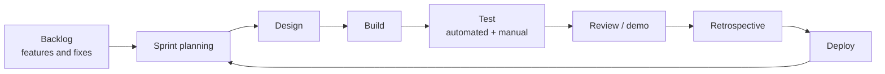
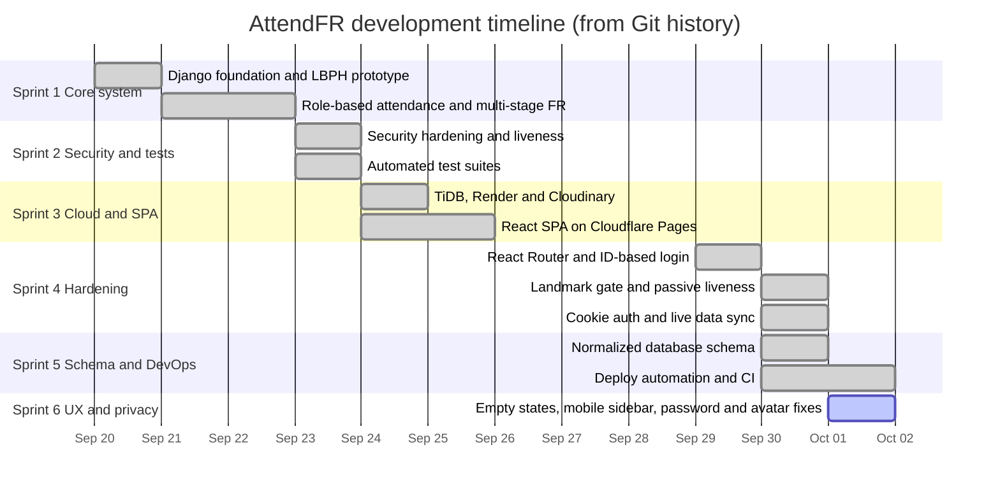
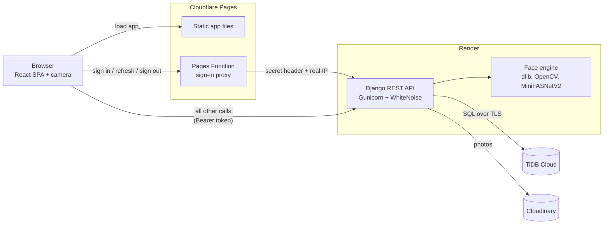
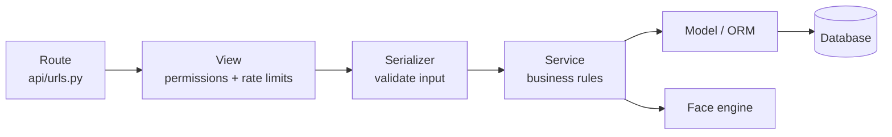
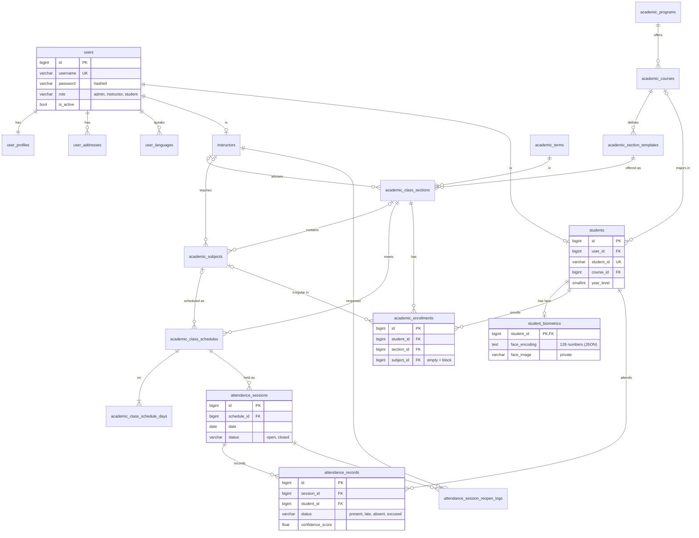
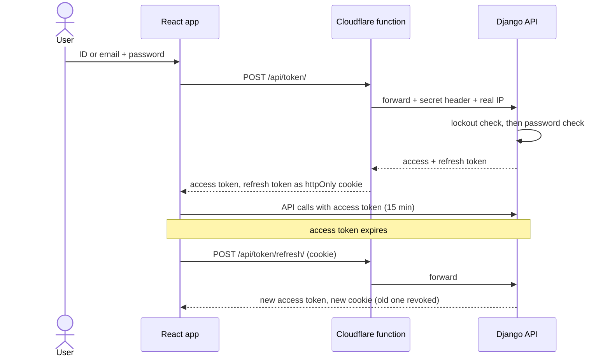
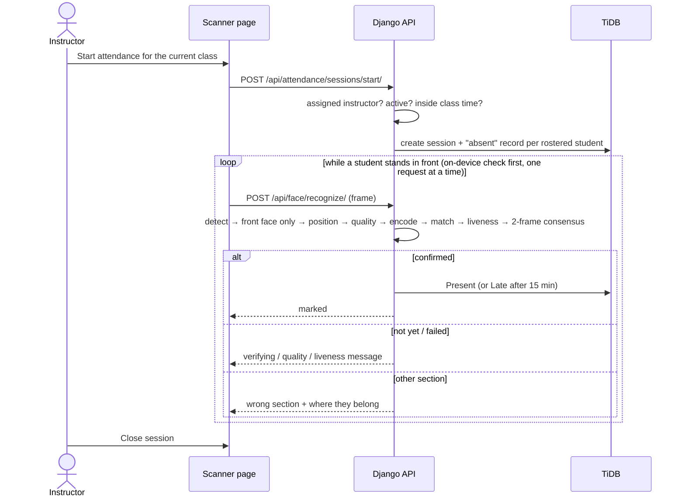
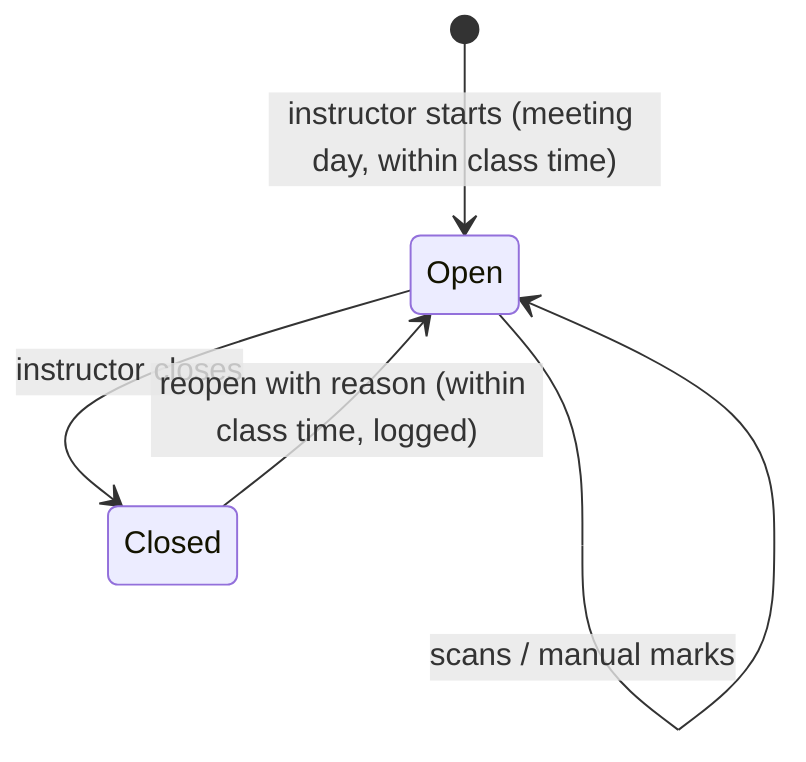
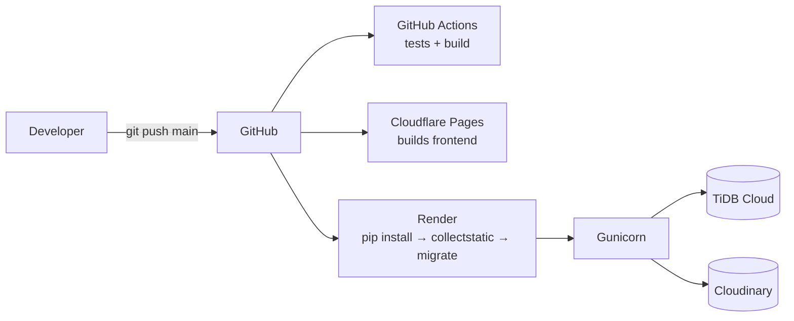

# AttendFR — Project Documentation

AttendFR is a web-based class attendance system. The instructor starts attendance for the class
that is in session and points a webcam or phone camera at the students. Each recognized student
is marked **Present** or **Late**. Photos and phone screens are rejected, so a student cannot be
marked present by someone else.

This document explains how the project was built, what changed over time, how each part works,
and where things stand now. Numbers, table names and file paths come straight from the code.

| | |
|---|---|
| Current version | 3.0 (clean database schema), plus unreleased Sprint 6 work |
| Frontend | React 19 SPA on Cloudflare Pages |
| Backend | Django 6 REST API on Render |
| Database | TiDB Cloud (MySQL-compatible) |
| Photo storage | Cloudinary |
| Tests | 262 backend, 103 frontend, GitHub Actions CI |
| Last updated | October 3, 2026 |

## Contents

1. [Overview](#1-overview)
2. [Development Process (SDLC)](#2-development-process-sdlc)
3. [Changelog](#3-changelog)
4. [Architecture](#4-architecture)
5. [Database](#5-database)
6. [How It Works](#6-how-it-works)
7. [Security](#7-security)
8. [API Reference](#8-api-reference)
9. [Frontend](#9-frontend)
10. [Deployment](#10-deployment)
11. [Testing](#11-testing)
12. [Current Status and Roadmap](#12-current-status-and-roadmap)
13. [Reference: Settings and Commands](#13-reference-settings-and-commands)
14. [Technical Guide: Tools, Folders, Files, Classes and Flows](#14-technical-guide-tools-folders-files-classes-and-flows)

---

## 1. Overview

### 1.1 Main features

- **Face attendance.** Recognizes enrolled students one at a time in about 1–3 seconds each.
  A student is marked Present, or Late if more than 15 minutes after the class start.
- **Right class only.** Only the assigned instructor can start a session, only on the class's
  meeting day and within its scheduled time. Only students enrolled in that class are matched.
- **Block and irregular students.** A student can be enrolled in a whole section (block) or in
  just one of its subjects (irregular).
- **Wrong-section detection.** A student who scans in the wrong class is told which section they
  belong to.
- **Anti-spoofing.** Every frame is checked for quality and liveness. A student is marked only
  after three matching frames in a row.
- **One face per student.** A face already enrolled to another student cannot be enrolled again.
- **Corrections with an audit trail.** Instructors can mark students manually and reopen a closed
  session with a reason, which is logged.
- **Reports.** Role dashboards, section reports, session logs and a personal calendar for each
  student.
- **Live updates.** Open screens refresh by themselves when the data changes.

### 1.2 Roles

| Role | Can do | Cannot do |
|---|---|---|
| Administrator | Set up programs, courses, sections, subjects and schedules; manage users; admit students; enroll faces; view all reports | Run attendance sessions |
| Instructor | Start, close and reopen sessions for their own classes; run the scanner; mark students manually; view reports for their sections | Change the academic structure or other instructors' classes |
| Student | View their schedule, attendance per subject and calendar; edit their profile | See other students' data |

Everyone signs in with their Student ID, Faculty ID, username or email.

**Explanation:** The duties are split on purpose. The person who sets up the data (admin) is not
the person who takes attendance (instructor). The server checks every role rule, not just the
menu, so typing the URL of a hidden page gets the user nowhere.

### 1.3 Terms used in this document

| Term | Meaning |
|---|---|
| Face encoding | 128 numbers that describe a face, produced by dlib. Two photos of the same person give close numbers. |
| Distance / tolerance | How different two encodings are. The tolerance is the largest distance still accepted as the same person. |
| Liveness | Checking that the camera sees a real person, not a photo or screen. |
| Consensus | The 3 matching frames in a row needed before a student is marked. |
| Section template | A reusable section of a course, e.g. *BSIT-4A, 4th year* (the "Section Catalog"). |
| Class section | A section template offered in a term (school year + semester). |
| Block / irregular | Enrolled in the whole section / in only one subject of it. |
| Session | One class meeting's attendance. There is one per schedule per day. |

---

## 2. Development Process (SDLC)

### 2.1 Approach: Agile Scrum

The project uses **Agile Scrum**: short sprints, each ending with a working version. Every sprint
goes through planning, design, building, testing, review and deployment.



**Explanation:** Each pass through the loop is one sprint. A few items are picked from the
backlog, built and tested, then shown in a review. The retrospective is where the team agrees
on what to do better, and the working version is deployed before the next sprint starts.

**Why Scrum and not Waterfall:** face recognition can only be tuned with real cameras, real
lighting and real people. Short sprints let the thresholds and the camera UX be adjusted many
times. A single long Waterfall phase would only find these problems at the end.

### 2.2 Timeline

Dates come from the Git history (48 commits so far).



**Explanation:** Each bar is a block of work on the dates it was committed. The sprints are
short (1–3 days) because each one had a single clear goal. There were no commits from
September 26 to 28.

### 2.3 Sprints

| Sprint | Dates | Goal | Result |
|---|---|---|---|
| 1 | Sep 20–22 | Working prototype | Django app with templates, LBPH face recognition, role-based attendance, wrong-section prevention |
| 2 | Sep 23 | Secure and testable | Security hardening (IDOR fixes, DRF permissions, cookie hardening, anti-spoofing), first automated test suites |
| 3 | Sep 24–25 | Online | TiDB Cloud, Render, Cloudinary, React SPA on Cloudflare Pages, CRUD for every module, student admission |
| 4 | Sep 29–30 | Accuracy, security, UX | dlib recognition hardened, ID-based login, landmark quality gate and passive liveness, httpOnly cookie sign-in, live sync |
| 5 | Sep 30–Oct 1 | Clean data and reliable deploys | Normalized schema, deploy tasks inside `migrate`, CI, TiDB and static-file fixes |
| 6 | Oct 1 | Consistency and privacy | One Add button for empty tables, mobile sidebar fix, no default passwords, local avatars, this documentation |

**Explanation:** Each sprint builds on the last: first make it work, then make it safe, then put
it online, then make it accurate, then make the data and deploys clean. Sprint 6 work is
committed; Sprint 7 (instructor feedback and speed) is in progress.

### 2.4 Backlog

| Item | Priority | Status |
|---|---|---|
| Sign in with Student ID / Faculty ID / username / email | High | Done |
| Manage the academic structure, with room and instructor conflict checks | High | Done |
| Guided face enrollment, one face per student | High | Done |
| Block and irregular enrollment | High | Done |
| Attendance only for the assigned instructor during class time | High | Done |
| Automatic Present / Late by face, with photos and screens rejected | High | Done |
| Manual marking and audited reopen | Medium | Done |
| Wrong-section detection | Medium | Done |
| Reports, dashboards and student calendar | High | Done |
| Live updates of open screens | Low | Done |
| Server-side student search for large rosters (instead of long dropdowns) | Medium | Planned |
| Student self-registration with adviser approval | Medium | Planned |
| Consent step and retention policy for face data | Medium | Planned |
| Export reports to CSV / PDF | Low | Planned |

**Explanation:** The backlog is the to-do list of the whole project, ordered by priority. Items
are only marked "Done" when they are deployed and covered by tests. "Planned" items are covered
again in section 12.

---

## 3. Changelog

Versions follow the Git tags (`v2.0.0`, `v2.1.0`). Newest first.

### Unreleased (Sprint 7: instructor feedback + speed)

- **Removed:** Public registration (students and faculty), the admin Registrations page and the
  Turnstile CAPTCHA. The admin creates every account. The `account_registrations` table is kept
  (already migrated) but no longer used. The face-enrollment gate moved to
  `attendance_fr/api/services/auth.py`.
- **Changed:** The admin types the **Student ID** in the admission form (required, never
  auto-filled).
- **Speed (enrollment):** the live "Hold still" check no longer computes a face code it then
  discarded: ~1.8 s → ~0.05 s per frame on a developer PC. Frame gap 500 → 300 ms.
- **Speed (attendance):** only the face in front is encoded (people in the background are never
  encoded or matched); one image decode per frame; no extra database queries per frame; the
  phone/laptop only uploads a frame when its own detector sees a near, centred face.
  2 confirmation frames (was 3), 60 ms gap while confirming. One frame ≈ 0.39 s on a developer PC.
- **Scale:** one compact copy of all enrolled face codes per server worker (512 bytes per
  student, 26 MB at 50,000), shared by the duplicate check and the wrong-section check. It is
  refreshed from the database only for the faces that changed.
- **Mobile:** front/back camera switch; portrait phone frames are sent at 360×640.
- **UI:** "Enroll Student into this Section" uses type-to-search instead of a long dropdown
  (`components/shared/SearchSuggest.jsx`, `utils/fuzzySearch.js`). Names starting with the
  typed text come first; a typo gets "Did you mean …?" ("krisyan" → "Kristan"); Student IDs
  must match exactly; students already in the section are shown but cannot be picked. The
  irregular "Target Subject" box works the same way.
- **Late rules:** starting attendance 5+ minutes after the scheduled time asks the instructor
  "Present (late counts from now)" or "Late, with a reason". Scans after a reopen are Late with
  the reopen reason. The reason is shown under the student in the scanner roster. New setting
  `LATE_START_PROMPT_MINUTES` (5). See 6.3.
- **Attendance safety:** marking is one atomic database update ("only if still absent"), so two
  scans confirming the same student at once give one mark and keep the first time-in. The
  2-frame streak is stored in the shared database cache, so frames that reach different server
  workers still count together. Checked with 20 students scanned in a row (each marked once in
  exactly 2 frames, lingering and repeat scans changed nothing, a stranger and a student from
  another section were never marked).
- **New settings:** `FACE_SCAN_MIN_FACE_RATIO` (0.15), `FACE_SCAN_CENTER_ZONE` (0.3);
  `FACE_CONSENSUS_FRAMES` default 3 → 2; `THROTTLE_FACE_RECOGNIZE` 180 → 300/min.
- **Database:** indexes `record_session_status_idx` and `record_student_idx` on
  `attendance_records` (migration `core.0002_add_attendance_record_indexes`).
- **Speed (enrollment, Oct 3):** `FACE_ENROLL_JITTERS` 4 → 1. The final "Processing" step
  dropped by about 3–4 s. On-camera prompts are now 2–3 words ("Open your eyes", "Look
  straight") in a small pill, and the side tips are shorter.
- **Accuracy (phones, Oct 3):** the live scan finds the face on a small copy of the frame, so its
  box was a few pixels off and the face code shifted (measured 0.13, against a 0.38 limit).
  `encode_scan_face` now re-detects the face at full size around that box (`_refine_face_location`)
  before encoding (error 0.13 → 0.0 on the test photo).
- **Safety limits (Oct 3):** `FACE_HARD_MAX_DISTANCE = 0.40` and `FACE_HARD_MIN_MARGIN = 0.08` in
  `settings.py` are applied on top of the environment values, so a loose value on the Render
  dashboard (the live service had tolerance 0.5) can no longer make one student match another.
- **Scanner (Oct 3):** after a student is marked or found already marked, the phone stops uploading
  while the same face stays in view (resumes when the face leaves, jumps to a different position
  or size, or after 3 s). Measured on Render: re-checks of a lingering student went from one every
  ~1.6 s to one every ~4.5 s. See `holdDecision` in `useAttendanceRecognition.js`.
- **Camera (Oct 3):** the scanner releases the old camera before opening a new one, retries with
  simpler constraints, treats an interrupted `play()` as normal, no longer blocks on the optional
  on-device detector, and shows plain camera error messages.
- **Diagnostics (Oct 3):** every scanned frame writes one `scan timing` log line
  (`FACE_TIMING_LOG`): time per step, outcome, and the match `dist` and `margin`. New command
  `python manage.py face_diagnose` shows how close enrolled faces are to each other.
- **UI (Oct 3):** clicking a subject in the section table (or a roster chip) filters the meeting
  schedules to that subject; the type-to-search list is drawn on top of modals so it is no
  longer clipped.
- **Config (Oct 3):** environment variable names are the same in `.env`, `.env.example`,
  `render.yaml` and the Render dashboard. Turnstile settings, CSP entries and variables were
  removed with public registration. `CSRF_TRUSTED_ORIGINS` and `SEED_ADMIN_PASSWORD` are now in
  `.env.example`.
- **Tests:** 262 backend, 110 frontend (registration tests removed with the feature; new tests
  cover the scanner pause for a queue of students).

### Sprint 6 (public registration was later removed in Sprint 7)

- **Feature:** Public registration with admin approval for students and faculty. The registration
  form collects **complete profile information** matching the admin registration form: ID, full name
  (first, middle, last), gender, birth date and place, civil status, religion, citizenship,
  languages spoken, complete address (street, region, province, municipality via cascading dropdowns),
  mobile number, telephone, email, program/course/year (students) or department (faculty), and
  password. Programs and courses are loaded dynamically from the database (same as admin sees).
  The admin assigns sections and subjects after approval. Accounts awaiting approval show
  `is_active=False` plus an `account_registrations` row (status: pending / approved / rejected),
  and are excluded from the users list. Signing in on a pending or rejected account returns 403
  with `registration_pending` or `registration_rejected`. Registering after rejection replaces
  the previous attempt. New table: `account_registrations` (migration
  `accounts.0003_account_registrations`).
- **Feature:** Required student face enrollment for all students who lack a face photo.
  Self-registered and admin-created students alike must enroll a face before they can use any
  part of the app. The gate is enforced in `RevocationAwareJWTAuthentication.authenticate` and
  returns 403 `face_enrollment_required`; the frontend shows `FaceEnrollmentGateView`. Paths
  allowed without a face: `/api/auth/`, `/api/token/`, `/api/sync/versions/`,
  `/api/face/enroll/check/`, `/api/face/enroll/self/`, `/api/health/`. The enrollment is checked
  once (cached 120s), and no admin review is needed. Turned off in tests unless
  `override_settings(FACE_ENROLLMENT_GATE=True)` is given.
- **Security:** Cloudflare Turnstile CAPTCHA on the registration form, only when
  `TURNSTILE_SECRET_KEY` is set (off in local dev). It fails closed and checks action `register`.
  The frontend receives the site key from `/api/register/options/` so only the secret lives in
  Render; Turnstile is loaded at `https://challenges.cloudflare.com/turnstile/v0/api.js` and
  this domain is added to the CSP (`script-src`, `frame-src`).
- **Security:** Registration rate limit of 30 tries per hour per IP. Throttle scope: `register`.
- **UI:** Empty tables show one centered message with a single Add button. Once there are records,
  the Add button moves to the page header. This is the same on every admin table.
- **UI:** The sidebar menu, account card and Sign Out scroll together, so Sign Out can always be
  reached on phones (all roles).
- **UI:** New admin page "Registrations" (sidebar icon: UserPlus) lists pending and rejected
  accounts with one-click approve/reject controls. Includes student IDs, programs, courses,
  faculty IDs and submitted timestamps. Uses the live-sync group `people`.
- **Security:** The quick register form no longer falls back to `student123`. A strong password
  is required, and the API rejects accounts without one.
- **Privacy:** Avatars without a photo are drawn locally as initials. Names are no longer sent to
  `ui-avatars.com`, and that site is removed from the security policy.
- **Security:** `/admin/login/` now has the same lockout and rate limit as the app's sign-in
  and shares its counters. Before, it accepted unlimited password guesses.
- **Security:** The face-api library and its model are self-hosted under
  `frontend/public/vendor/face-api/1.7.14/`. The security policy now allows scripts only from
  our own site (jsDelivr removed), and the library loads only when a camera page needs it.
- **Security:** Every Python dependency, including sub-dependencies, is pinned to an exact
  version in `requirements.txt`, so builds cannot pick up a new or compromised release.
- **Feature:** Change password on the Profile page (every role). It needs the current password,
  shows the strength checklist and a live "Passwords match / do not match" indicator, and uses
  the same strict rules as the server. Afterwards every device is signed out
  (`POST /api/auth/password/`, 5 tries/min per user).
- **Feature:** Optional two-step sign-in for every role, with an authenticator app (Google /
  Microsoft Authenticator). Turned on in Profile → Security by scanning a QR code; after the
  password, sign-in asks for the 6-digit code. 10 one-time backup codes cover a lost phone,
  and `manage.py disable_2fa <id>` is the last resort. It also applies to `/admin/login/`.
  The secret is encrypted at rest, each code works once, and wrong codes count toward the
  login lockout. New tables: `user_two_factor`, `user_backup_codes`
  (migration `accounts.0002_two_factor`). New pinned packages: `pyotp`, `segno`.
- **UI:** Profile pages are grouped into tabs. Staff: Personal & contact, Professional,
  Institutional (instructors only), Security. Students: Personal, Contact & address, Academic,
  Security.
- **Docs:** New `README.md` (what the system is) and this document.
- **Tests:** 290 backend tests pass (was 262), 111 frontend tests (was 103). New: registration
  with Turnstile (21 tests), 2FA (18), password change (8), admin 2FA login (7), face enrollment
  gate, registration frontend (8), 2FA frontend, password change frontend, sidebar, avatars,
  quick register no-password rule.

### 3.0 — Clean schema (Sep 30 – Oct 1)

- **Database:** The schema was rebuilt and normalized. Sign-in credentials (`users`) are separate
  from personal details (`user_profiles`), Teacher was renamed Instructor, and every app starts
  again from a fresh `0001_initial` migration.
- **Deploys:** `migrate` now resets a database still on the old schema once, creates the cache
  table, and creates the `admin` account if it is missing. All of this runs on every deploy and
  changes nothing when there is nothing to do.
- **Tools:** Added `migrate_fresh --seed` (like Laravel's `migrate:fresh --seed`).
- **CI:** GitHub Actions runs the backend tests, frontend tests and build on every push.
- **Fix:** TiDB does not allow `ADD COLUMN … UNIQUE`, so `students.user_id` is now created with
  the table. A half-finished first migration is recovered automatically.
- **Fix:** Admin pages were unstyled in production. The app order is fixed so `collectstatic`
  copies the CSS.
- **Fix:** Schedule tests failed late at night; the test helper now keeps class times within the
  same day.

### 2.1.0 — Hardening (Sep 29–30)

- dlib-based recognition hardened. The head-turn challenge was replaced with a 68-point landmark
  quality gate plus passive liveness (MiniFASNetV2).
- Faculty ID / Student ID became the login username.
- Instructors only see their own subjects, even inside a shared section.
- Sign-in moved to an httpOnly refresh cookie through a Cloudflare Pages Function; the access token
  is kept in memory only.
- Live data sync added; the face capture UX was redesigned (hands-free, guided).
- Switched to React Router (real URLs instead of `#/` routes).

### 2.0.0 — Cloud and SPA (Sep 24–25)

- Moved to TiDB Cloud, Render and Cloudinary.
- New React SPA on Cloudflare Pages replaced the Django templates. The backend became a REST API.
- Full CRUD for programs, subjects, sections and schedules; student admission wizard.

### 1.x — Prototype (Sep 20–23)

- First Django version with server-rendered templates and LBPH face recognition.
- Role-based attendance, multi-stage recognition, wrong-section prevention.
- Security hardening and the first automated tests.

**Explanation:** The changelog records *what* changed and *why*, release by release. Anyone
reading it can tell why the system looks the way it does today. For example, it explains why
there is only one `0001` migration: the schema was rebuilt in 3.0.

---

## 4. Architecture

### 4.1 Big picture



| Part | Job |
|---|---|
| React SPA | All screens, camera capture, framing hints ("Move closer") |
| Pages Function (`frontend/functions/`) | Handles only sign-in, refresh and sign-out; keeps the long-lived token in an httpOnly cookie |
| Django API | Login, permissions, business rules, face enrollment and recognition |
| TiDB Cloud | All data: users, academic structure, attendance |
| Cloudinary | Profile photos (public) and face photos (private, served through signed links) |

**Explanation:** The browser loads the app from Cloudflare once. Sign-in traffic goes through a
small Cloudflare function so the long-lived token never reaches JavaScript. Everything else goes
straight to the API on Render. Only the API touches the database and photos, and it runs the
face engine itself. The browser only helps with framing and never decides who a face belongs
to.

### 4.2 Backend layers



**Explanation:** Every request takes the same path. The view checks *who* is calling, the
serializer checks *what* they sent, and the service applies the rules, for example "only during
class time". Keeping the rules in services means the same rule is used everywhere. The rule for
who is on a class roster, for example, is shared by recognition, manual marking and reports.

### 4.3 Folder structure

```text
Attendance-Face-Recognition/
├── attendance_fr/          Django project: settings, URLs, auth, permissions, photo storage
│   ├── api/views/          one file per area (auth, classes, attendance, face, reports…)
│   ├── api/serializers/    input validation and JSON output
│   ├── api/services/       business rules (users, attendance, face enrollment, cache, lockout)
│   └── tests/              backend tests (+ factories.py for test data)
├── accounts/               users, profiles, addresses, languages, revoked tokens
│   ├── deploy.py           tasks run with every `migrate`
│   └── management/commands migrate, migrate_fresh, reset_legacy_schema, unlock_login, …
├── core/                   academic structure, enrollments, attendance (models + services)
├── face_app/               face engine: detection, encoding, quality gate, liveness, matching
│   ├── data/               OpenCV Haar cascades (fallback detector)
│   └── models/             MiniFASNetV2 anti-spoofing model (ONNX)
├── frontend/
│   ├── src/views/          one component per page
│   ├── src/components/     feature parts (scanner, faceCapture, sections, users…)
│   ├── src/ui/             shared loaders, dialogs, badges, empty-table row
│   ├── src/test/           frontend tests
│   ├── functions/          Cloudflare sign-in proxy
│   └── public/             _headers (security policy), _redirects (SPA routing)
├── .github/workflows/      CI
├── build.sh, render.yaml   Render build
├── seed.py                 admin + demo data
└── isrgrootx1.pem          public root certificate for TLS to TiDB
```

**Explanation:** The backend has one Django app per job: `accounts` (people), `core` (school
structure and attendance) and `face_app` (faces). `attendance_fr` ties them together and holds
the API. Generated folders such as `.venv/`, `node_modules/`, `dist/` and `staticfiles/` are not
in Git. A file-by-file guide, with the classes and functions in each file, is in
[section 14.3](#143-folder-and-file-guide).

---

## 5. Database

### 5.1 ERD



**Explanation:** Each box is a table and each line a relationship. `||` means exactly one, `o|`
zero or one, `o{` zero or many, and `|{` one or many. The key columns are shown only for the
most important tables; section 5.2 lists all of them. In `academic_enrollments`, an empty
`subject_id` means a block student and a filled one means an irregular student.

### 5.2 Tables

| Group | Table | Holds | Key rules |
|---|---|---|---|
| People | `users` | Sign-in only: username, password hash, email, role, active flag | username unique |
| | `user_profiles` | Names, birth data, contact numbers, photo (1:1 with users) | |
| | `user_addresses`, `user_languages` | Addresses (current / permanent) and languages as rows | one address per kind; one row per language |
| | `instructors` | Faculty ID, department, position, office… | faculty_id unique |
| | `students` | Student ID, course, year level | student_id unique |
| | `student_biometrics` | The one face encoding and private face photo per student | one per student |
| | `user_two_factor`, `user_backup_codes` | Optional authenticator-app secret (encrypted) and one-time backup codes (hashed) | one per user / 10 codes per user |
| | `account_registrations` | Self-registration attempts (status: pending / approved / rejected), reviewed_by, rejection_reason, face_consent_at | one active row per user |
| | `revoked_tokens` | Signed-out / already-used login tokens | jti unique |
| Academic | `academic_programs` | College / program (e.g. CITEC) | code unique |
| | `academic_courses` | Degree course under a program (e.g. BSIT) | code unique per program |
| | `academic_terms` | School year + semester | unique pair |
| | `academic_section_templates` | Section Catalog entry (e.g. BSIT-4A) | name unique per course |
| | `academic_class_sections` | A template offered in a term | one per template per term |
| | `academic_subjects` | Subject in a section, with its instructor | course must match the section |
| | `academic_class_schedules` | Start/end time, room, effective dates | no room or instructor overlap |
| | `academic_class_schedule_days` | One row per meeting day | one row per day per schedule |
| | `academic_enrollments` | Student in a section (block) or one subject (irregular) | no duplicates |
| Attendance | `attendance_sessions` | One class meeting's attendance | **one per schedule per date** |
| | `attendance_records` | One student's status in a session, time and confidence | **one per student per session** |
| | `attendance_session_reopen_logs` | Who reopened a session, when and why | append-only |

Django also creates its own tables (`auth_*`, `django_*`) plus `attendfr_security_cache` for
login-lockout counters.

**Explanation:** The schema is normalized (3NF): each fact is stored in one place only. A class
section does not copy its name or course; it reads them from its template. Names live only in
`user_profiles`. Face data sits in its own table, so normal student queries never load it. The
bold rules are enforced by the database itself, so duplicate sessions or duplicate attendance
records are impossible even if the code has a bug.

---

## 6. How It Works

### 6.1 Sign-in



**Explanation:** The password is checked only on the server, after the lockout check. The
refresh token lives in a cookie that page scripts cannot read, and each refresh token works only
once. The short access token is kept in memory and renewed silently, so users stay signed in
without the token sitting in browser storage.

### 6.2 Face enrollment

1. The admin picks a student and starts the camera.
2. The app guides the student ("Center your face", "Move closer", "Hold still") using on-device
   face detection.
3. Each candidate frame (at least 300 ms apart) is sent to `/api/face/enroll/check/`, which runs
   every server gate below but does **not** compute the face code and saves nothing (~50 ms on a
   developer PC). A rejected frame shows its reason live ("Keep your eyes open").
4. After 3 accepted frames, the app sends them to `/api/face/enroll/`.
5. The server checks each frame again, computes its 128-number code (1 jitter, ~0.4–0.5 s per
   frame on a developer PC; this is the "Processing" step), and combines the frames into one
   identity. `FACE_ENROLL_JITTERS` can be raised to 2–4 for a steadier stored face at the cost
   of a slower "Processing" step.
6. The duplicate check compares that identity with every other enrolled student in one matrix
   calculation (~44 ms at 50,000 students).

| Check (each frame) | Rule |
|---|---|
| Image | JPEG / PNG / WEBP, ≤ 2 MB, ≤ 4096 px |
| Detection | dlib HOG only (strict); the face must be inside the on-screen oval with no similar-size second face |
| Quality (68 landmarks) | eye distance ≥ 45 px, brightness 50–215, sharpness ≥ 40, yaw ≤ 15°, pitch ≤ 20°, roll ≤ 10°, eyes open (EAR ≥ 0.20) |
| Liveness | texture, glare and colour checks + MiniFASNetV2 live score ≥ 0.70 |

| Check (combined) | Rule |
|---|---|
| Enough good frames | at least 2 of the 3–5 sent |
| Same person | every pair of frames within 0.5 |
| Not a repeated still image | frames must not be identical |
| Not someone else's face | no other enrolled student within 0.5 → otherwise `409 duplicate_face` |
| Re-enrolling | a different-looking face needs confirmation → otherwise `409 face_mismatch` |

The saved identity is the **average** of the good frames (128 numbers). The face crop is stored
in private storage.

**Explanation:** Checking one frame at a time gives the student instant feedback instead of a
failed capture at the end. Enrollment is stricter than scanning because this face is what every
future scan is compared against. A bad enrollment would cause wrong matches for the whole
semester.

### 6.3 Taking attendance



| Step | Rule |
|---|---|
| On-device check (phone/laptop) | a frame is uploaded only when the local detector sees a face at least 12% of the frame width and near the middle; otherwise "Waiting for a student" / "Move closer" / "Center your face" |
| Upload | JPEG 0.72, at most 480 px wide (landscape) or 640 px tall (portrait phone), ~25 KB |
| Detect | dlib HOG on a 0.42× downscaled frame (fast) |
| Pick face | **only** the largest, most central face. Faces behind are counted but never encoded or matched |
| Position | face width ≥ 15% of the frame (`FACE_SCAN_MIN_FACE_RATIO`), centre within 30% of the middle (`FACE_SCAN_CENTER_ZONE`) |
| Quality | eye distance ≥ 28 px, brightness 40–230, sharpness ≥ 25, yaw ≤ 20°, pitch ≤ 25°, roll ≤ 15°, eyes open (EAR ≥ 0.17) |
| Refine box | the face is re-detected at full size in a window around the fast box, so the face code is built from a precise crop (`_refine_face_location`) |
| Encode | 128-number code of that one face (1 jitter). The only slow step: ~0.4–0.5 s on a developer PC, ~0.9–1.1 s on Render free |
| Match | against **this class's roster only**: distance ≤ tolerance (code default 0.38), confidence ≥ 0.62, at least 0.08 better than the 2nd-best student. Hard limits in code: distance never above 0.40, margin never below 0.08, whatever the environment says |
| Pause (phone) | after `matched` / `already_marked` the phone stops uploading while the same face stays in view; it resumes when the face leaves, jumps to a different position or size, or after 3 s |
| Liveness | same checks as enrollment; fails closed (if it cannot run, the face is rejected) |
| Consensus | 2 matching frames in a row (`FACE_CONSENSUS_FRAMES`); identical frames do not count |
| Present / Late | Late if more than `LATE_THRESHOLD_MINUTES` (15) after the start (see "Starting late" below); a second scan never changes the first time-in |
| Wrong section | no roster match, but a live match with another enrolled student in the school → show their section |

**Explanation:** The order is what makes it safe and fast. Cheap checks run first, so the slow
face code is only computed for a usable face. Only the student in front is scanned, so people
walking behind cannot be marked and do not slow the scanner. Fakes are caught before marking, and
two different live frames in a row are needed. The "better than the 2nd-best" rule stops two
look-alike classmates from being confused. Matching compares against the class roster (about 50
students) in memory, which takes about 2 ms whether the school has 150 or 50,000 students.

**Time per student** ≈ 2 × (server time + network) + 60 ms. Measured on a developer PC, one
frame takes ~0.39 s on the server, so about 1–1.5 s per student including the network. Measured
on Render's free plan (from the `scan timing` log, Oct 3): about 1.0–1.3 s per frame on the
server (the face code is ~0.9–1.1 s of that) plus ~0.3 s network, so **about 2.5–3.5 s per
student**; a borderline first frame can add one more frame. For a class of 40, the scanner
itself is a few minutes; most of the real time is students stepping up one by one.

**Where the time goes (one `scan timing` log line per frame):**
`base64 + image` (decode) → `detect` (find the face, 25–145 ms) → `roster` (class list from
cache + who is already marked, ~14 ms) → `gates` (position + quality, 5–80 ms) → `encode` (the
face code) → `match` → `live` (liveness, 3–140 ms) → `mark` (streak + saving, 40–160 ms). The line
ends with `outcome=` and the best match's `dist=` and `margin=`.

**Starting late (the instructor's delay is not the students' fault)**

| How attendance started | Present until | Late after | Saved on late records |
|---|---|---|---|
| On time (less than `LATE_START_PROMPT_MINUTES`, 5, after the scheduled start) | scheduled start + 15 min | that | — |
| Late, instructor chose **Present** (recommended) | attendance start + 15 min | that | — |
| Late, instructor chose **Late, with a reason** | never | every scan | "Late start: <reason>" |
| **Reopened** session (closed, then reopened) | — | every scan after reopening | "Reopened session: <reopen reason>" |

Example: a 6:00–8:30 PM class whose instructor opens attendance at 7:00 PM is asked
"Present or Late?". With Present, students scanned until 7:15 PM are Present. Starting late
asks the question before anything is created (`409 late_start`, then the same request again
with `start_mode`). Students already marked before a close keep their status after a reopen.
Saved on the session: `start_mode`, `late_reason` (migration `core.0003_session_start_mode`).

### 6.4 Session states and corrections



- **Manual mark:** present, late, absent or excused, while the session is open and only for
  students on the roster.
- **Reopen:** only a closed session, only during class time, with a reason of 3–300 characters.
  Every reopen is saved in `attendance_session_reopen_logs`.

**Explanation:** Attendance can only change while a session is open. Any later correction has
to go through a reopen that records who did it and why, so the history cannot be quietly
rewritten.

### 6.5 Other rules

- **Roster:** a schedule's roster is every block student of the section plus the irregular
  students enrolled in that schedule's subject. Recognition, manual marking and reports all use
  this one rule.
- **Schedule conflicts:** a schedule is rejected if the same room, or the same instructor,
  already has a class on a shared day at an overlapping time.
- **Live sync:** saving data bumps a version number for its data group (people, academic,
  attendance, reports, dashboard). Each open browser tab asks for the versions every 3 seconds
  (paused in background tabs) and silently reloads only what changed.
- **Caching:** API responses are cached for 15–120 seconds depending on the group, and face
  rosters for 60 seconds. Every change clears the related cache right away.
- **Deploy tasks:** `migrate` also resets a database on the old schema (once), creates the
  lockout cache table, and creates the `admin` account if missing.

**Explanation:** These rules keep the data consistent. The same roster everywhere means reports
always match what the scanner did. Live sync means two people looking at the same page see the
same data without pressing refresh.

---

## 7. Security

| Risk | Protection |
|---|---|
| Stolen login token | Access token lasts 15 minutes and is kept in memory only. The refresh token sits in an httpOnly, Secure, SameSite=Strict cookie, works once, and is revoked on use and on sign-out. |
| Calls that skip the sign-in proxy | The proxy adds a shared secret (`AUTH_PROXY_SECRET`) that the API checks |
| Password guessing | 5 wrong tries per username + IP locks that pair for 15 minutes; 100 per account in 24 h locks the account; at most 10 logins/min per IP. Applies to both the app sign-in and `/admin/login/`, with shared counters. |
| Weak passwords | At least 8 characters with upper case, lower case, a digit and a symbol; common passwords and passwords similar to the name are rejected; no default passwords |
| Stolen password | Optional two-step sign-in (authenticator app) for every role, on the app and `/admin/`. Secret encrypted at rest (`TWO_FACTOR_KEY`), codes single-use, wrong codes count toward the lockout, backup codes stored as hashes |
| Seeing other people's data | Every endpoint checks the role. Instructors only reach their own subjects and sessions; students only their own records. |
| Face photo leaks | Private storage; the API gives out signed links that expire after 5 minutes and stop working when the photo is replaced |
| Spoofing | Quality gate, liveness (fails closed), 3-frame consensus, replay check, duplicate-face block |
| Bad uploads | Only real JPEG/PNG/WEBP images, size and dimension limits |
| Injected scripts / clickjacking | Content-Security-Policy allows scripts only from our own site (face-api is self-hosted); `X-Frame-Options: DENY`, `nosniff`; the camera is allowed only on the app's own site |
| Tampered dependencies | Every Python package is pinned to an exact version; the frontend uses `package-lock.json` with `npm ci` |
| Eavesdropping | HTTPS with HSTS; TLS to TiDB |
| Abuse of heavy endpoints | Rate limits: recognize 180/min, enroll 30/min, enroll check 240/min, face photos 600/min, sync 120/min |

**Explanation:** Each risk is covered by more than one layer, so one mistake does not expose
anything. Face data gets the most protection because it cannot be changed like a password if it
leaks.

---

## 8. API Reference

All routes are under `/api/`, return JSON, and need a Bearer token unless noted.

| Area | Routes | Who |
|---|---|---|
| Health | `GET /api/health/` | Public |
| Sign-in | `POST /api/token/`, `POST /api/token/refresh/`, `POST /api/auth/logout/` | Public (through the proxy in production) |
| Own account | `GET`/`PATCH /api/auth/me/`, `POST /api/auth/password/` | Signed-in user |
| Two-step sign-in | `POST /api/token/2fa/` (second sign-in step); `GET /api/auth/2fa/`, `POST /api/auth/2fa/setup/`, `…/enable/`, `…/disable/`, `…/backup-codes/` | Second step: holder of a valid sign-in challenge; the rest: signed-in user |
| Live sync | `GET /api/sync/versions/` | Signed-in user |
| Dashboard | `GET /api/dashboard/stats/` | All roles (different data per role) |
| Academic | `/api/programs/`, `/api/courses/`, `/api/program-sections/`, `/api/sections/`, `/api/subjects/`, `/api/schedules/` (+ `/{id}/`) | Read: all; write: admin |
| Enrollments | `/api/sections/{id}/enrollments/`, `…/enrollments/{eid}/` | Read: users with access to the section; write: admin |
| Users | `/api/users/`, `/api/users/{id}/`, `/api/students/`, `/api/students/next-id/` | Admin |
| Sessions | `GET /api/attendance/sessions/`, `POST …/start/`, `POST …/{id}/close/`, `POST …/{id}/reopen/`, `GET …/{id}/` | Instructor (own classes); list filtered by role |
| Manual mark | `POST /api/attendance/records/mark/` | The session's instructor |
| Student | `GET /api/attendance/student/overview/`, `GET /api/attendance/student/calendar/{section_id}/` | Student (own data) |
| Face | `POST /api/face/enroll/check/`, `POST /api/face/enroll/` | Admin |
| | `POST /api/face/enroll/self/` | Student without a face (first sign-in) |
| | `POST /api/face/recognize/` | The session's instructor |
| | `GET /api/media/face/{student_id}/?token=…` | Anyone holding a valid signed link |

Status codes: `400` bad input · `401` not signed in · `403` not allowed or outside class time ·
`404` not found or not yours · `409` conflict (duplicate face, closed session) ·
`429` too many requests or locked account · `503` face engine unavailable.

**Explanation:** Reading data is open to more roles than changing it. The status codes let the
app show the right message. For example, a 409 on enrollment becomes "This face is already
enrolled to …".

---

## 9. Frontend

| Role | Pages |
|---|---|
| Admin | Dashboard, Programs, Courses, Section Catalog, Class Sections, Subjects, Schedules, Users, Face Enrollment, Student Admission, Section Report, Session Logs, Profile |
| Instructor | Dashboard, Sections & Schedules, Attendance Reports, Live Scanner, Profile |
| Student | Dashboard, My Schedule, My Records, Profile |
| Public (not signed in) | Sign In only (accounts are created by the admin) |

**UI rules used on every page**

- The same layout everywhere: a sidebar (scrollable on phones, with the account card and Sign
  Out inside the scroll) and a header holding the page's main action.
- An empty table shows one centered message and **one** Add button. When records exist, the Add
  button is in the header instead. When filters hide every row, a "Clear filters" button is shown.
- Delete always asks for confirmation; deactivate is offered where history must be kept.
- Avatars show the photo, or initials drawn in the app.
- Face capture is hands-free with live guidance and automatic retries.

**Explanation:** Pages are protected twice: the app hides pages a role cannot open, and the API
refuses the data anyway. Keeping the same rules on every page means users learn the layout once.

---

## 10. Deployment



| Service | Runs | Needs |
|---|---|---|
| Cloudflare Pages | Frontend + sign-in proxy | `BACKEND_ORIGIN`, `PROXY_SECRET`, `VITE_*` |
| Render | Django API (health check `/api/health/`) | `SECRET_KEY`, `DEBUG=False`, `ALLOWED_HOSTS`, `CORS_ALLOWED_ORIGINS`, `CSRF_TRUSTED_ORIGINS`, `DB_*`, `CLOUDINARY_*`, `AUTH_PROXY_SECRET`, `TRUSTED_PROXY_COUNT=1`, `SEED_ADMIN_PASSWORD` |
| TiDB Cloud | Database | Port 4000, TLS on (`DB_USE_SSL=True`) |
| Cloudinary | Photos | API keys |

**First deploy**

1. Fill in the variables above. `AUTH_PROXY_SECRET` on Render and `PROXY_SECRET` on Cloudflare
   must have the same value.
2. **Generate and set `TWO_FACTOR_KEY`** (see below) — do this before anyone enables 2FA!
3. Turnstile keys are no longer needed (public registration was removed).
4. Set `SEED_ADMIN_PASSWORD`, then deploy.
5. Check that `/api/health/` returns `{"status": "healthy", "database": "connected"}`.
6. Sign in as `admin` and change the password.

**Setting up TWO_FACTOR_KEY (Important!)**

The `TWO_FACTOR_KEY` encrypts 2FA secrets in the database. Set it once and **never change it**, or
everyone who enabled 2FA will lose access.

1. Generate a secure random 50-character key:
   ```powershell
   # PowerShell
   -join ((48..57) + (65..90) + (97..122) | Get-Random -Count 50 | ForEach-Object {[char]$_})
   ```
   Or use https://1password.com/password-generator/ (50 characters, letters + numbers)

2. On Render → Environment → Add Environment Variable:
   - Key: `TWO_FACTOR_KEY`
   - Value: (your 50-character random key)
   
3. Save and redeploy.

4. **Store this key safely** (password manager) in case you need to restore a backup.

If you skip this step, it falls back to `SECRET_KEY`, which means rotating `SECRET_KEY` later will
break everyone's 2FA.

**Explanation:** A push to `main` runs the tests on GitHub and rebuilds the frontend on
Cloudflare. Render rebuilds the API too if its Auto-Deploy is on; it is currently off, so use
**Manual Deploy → Deploy latest commit**. The database setup happens inside `migrate` during the
build, so no shell access to the server is needed.

---

## 11. Testing

| Type | Tool | Covers |
|---|---|---|
| Backend unit + API | Django test runner (in-memory SQLite, never TiDB or Cloudinary) | Face engine, rules, every endpoint's permissions and responses |
| Security | Django test runner | Lockout, token rotation and revocation, proxy secret, access control, signed photo links |
| Frontend components | Vitest + Testing Library | Routing guards, forms, scanner, modals, empty states, sidebar, avatars |
| Lint / build | oxlint, Vite | Code mistakes, production build |
| Manual | Real cameras and users | Lighting, phones, spoof attempts |

| Backend file | Tests | Focus |
|---|---|---|
| `test_security.py` | 46 | Login security, tokens, passwords |
| `test_face_recognition.py` | 30 | Recognition, consensus, duplicates, wrong section |
| `face_app/tests.py` | 29 | Face engine helpers |
| `tests_api.py` | 20 | API contract |
| `test_authorization.py` | 19 | Who can access what |
| `test_two_factor.py` | 18 | Two-step sign-in: setup, codes, backup codes, lockout, admin login, turn off |
| `test_face_photos.py` | 15 | Private photos and signed links |
| `core/tests.py` | 13 | Models, schedules, conflicts |
| `test_classes.py` | 11 | Sections, subjects, enrollments |
| `accounts/tests.py` | 10 | Users and login |
| `test_schema.py` | 9 | Normalized tables, no default password |
| `test_response_cache.py` | 8 | Caching and live sync |
| `test_password_change.py` | 8 | Change password: rules, wrong current password, sign-out everywhere |
| `test_attendance.py` | 7 | Sessions and manual marking |
| `test_admin_login.py` | 7 | Lockout and rate limit on `/admin/login/` |
| `test_courses.py`, `test_auth.py`, `test_reports.py` | 12 | Courses, sign-in, reports |

The runner reports **262 backend tests**. Vitest reports **110 frontend tests** in 20 files.

```bash
python manage.py test                    # backend (262 tests)
cd frontend && npm test                  # frontend (110 tests)
cd frontend && npm run lint && npm run build
```

**Latest results (Oct 3, 2026):** frontend 110/110 passed and the build succeeds; lint shows
warnings only, no errors. Backend 262/262 passed. The full backend and frontend suites run in
CI on every push.

**Bugs caught by testing**

| Bug | How it was found | Fix |
|---|---|---|
| Schedule tests failed after ~11:15 PM | Full test run | Test class times stay within the same day |
| TiDB refused part of the first migration | Production deploy log | Column created with its table; half-built databases recover automatically |
| Admin pages without CSS in production | Deploy log | App order fixed so static files are collected |
| Quick register used a shared default password | Code review | Password required; test added |

**Explanation:** Security and face recognition have the most tests because mistakes there do
the most damage. Two of the bugs above appeared only in production, which is why every deploy
log is read. Each fix comes with a test or an automatic recovery, so the bug cannot quietly
return.

---

## 12. Current Status and Roadmap

### 12.1 Working now

- Every feature in section 1.1, deployed on Cloudflare Pages, Render and TiDB with a fresh clean
  schema and an `admin` account.
- CI on every push.

### 12.2 Not yet committed

Nothing. Everything described here is committed and pushed to `main` (latest work: Oct 3, 2026).

### 12.3 Known issues and limits

| Issue | Impact | Plan |
|---|---|---|
| User and student lists return at most 100 records, and searches only look inside those | Students beyond the first 100 do not appear in the section-enroll dropdown or in Face Enrollment search | Server-side search + pagination |
| Render free tier sleeps and has 1 worker | First request after idle can take ~50 s; many scans at once queue up | Paid instance; background worker for matching |
| In-memory cache per worker | Cache and rate limits are not shared if more workers are added | Redis |
| Recognizes one face at a time | Students scan in a queue | Acceptable for now |
| Starting a session again after closing it on the same day | Not possible (one session per meeting) | Use **Reopen** |
| `FACE_RECOGNITION_TOLERANCE` is 0.38 in code but was 0.5 in `render.yaml` | The live value depends on the Render dashboard setting; a loose value made phones match the wrong student | Set 0.38 on Render. Code now also enforces hard limits (distance ≤ 0.40, margin ≥ 0.08) |
| Face code takes ~1 s per frame on the Render free plan | About 2.5–3.5 s per student at the scanner | Paid instance (more CPU); the pause for a finished student already removes wasted re-scans |
| `render.yaml` is not linked to the live Render service | Changing the file does nothing | Link it as a Blueprint, or delete it |
| Render Auto-Deploy is off | Each deploy is manual | Turn on "After CI Checks Pass" |
| Early history still contains an old prototype `db.sqlite3` (4 test users with password hashes) | The file is gone from the current code, but Git keeps old versions | Those accounts belong to the retired prototype schema; never reuse their passwords. Rewriting history is possible but not needed |

### 12.4 Roadmap

1. Server-side student search (prefix search on indexed Student ID and names) and pagination.
2. Student self-registration, active only after adviser or instructor approval.
3. Consent step before face enrollment and a retention policy for face data (Data Privacy Act).
4. CSV / PDF report export and low-attendance alerts.
5. Paid hosting, Redis and a background worker before school-wide use.

**Explanation:** This section is the honest picture of the project today: what works, what is
waiting to be committed, and what is known to be weak. The roadmap is ordered by what users will
hit first. For example, the 100-record limit matters as soon as a school has more than 100
students.

---

## 13. Reference: Settings and Commands

### 13.1 Main settings (environment variables)

| Variable | Purpose | Default |
|---|---|---|
| `SECRET_KEY`, `DEBUG`, `ALLOWED_HOSTS` | Django basics | —, `False`, localhost |
| `CORS_ALLOWED_ORIGINS`, `CSRF_TRUSTED_ORIGINS` | Frontend address(es) | localhost dev ports |
| `DB_ENGINE`, `DB_HOST`, `DB_PORT`, `DB_NAME`, `DB_USER`, `DB_PASSWORD`, `DB_USE_SSL` | Database | local MySQL |
| `CLOUDINARY_CLOUD_NAME`, `CLOUDINARY_API_KEY`, `CLOUDINARY_API_SECRET` | Photo storage (local files if blank) | blank |
| `AUTH_PROXY_SECRET` | Shared secret with the Cloudflare proxy | blank |
| `FACE_ENROLLMENT_GATE` | Require face before a student can use the app | `True` (off in tests) |
| `TWO_FACTOR_KEY` | Encryption key for two-step sign-in secrets; set once and never change it | falls back to `SECRET_KEY` |
| `TRUSTED_PROXY_COUNT` | Proxies in front of Django (Render = 1) | `0` |
| `JWT_ACCESS_MINUTES`, `JWT_REFRESH_DAYS` | Token lifetimes | `15`, `7` |
| `LOGIN_MAX_FAILED_ATTEMPTS`, `LOGIN_LOCKOUT_MINUTES` | Lockout per username + IP | `5`, `15` |
| `LOGIN_ACCOUNT_MAX_FAILURES`, `LOGIN_ACCOUNT_WINDOW_HOURS` | Lockout per account | `100`, `24` |
| `THROTTLE_FACE_RECOGNIZE` | Scanner frames per instructor | `300/min` |
| `THROTTLE_TWO_FACTOR`, `THROTTLE_PASSWORD_CHANGE` | Two-step sign-in and password-change limits | `10/min`, `5/min` per user |
| `FACE_RECOGNITION_TOLERANCE` | Max match distance (lower = stricter) | `0.38` |
| `MIN_FACE_CONFIDENCE`, `FACE_MATCH_MARGIN` | Confidence floor, gap to 2nd best | `0.62`, `0.08` |
| `FACE_CONSENSUS_FRAMES` | Live frames in a row before marking | `2` |
| `FACE_SCAN_MIN_FACE_RATIO`, `FACE_SCAN_CENTER_ZONE` | Only the student in front is scanned: min face width / frame width, max centre offset | `0.15`, `0.3` |
| `FACE_ENROLL_JITTERS` | Re-reads per enrollment frame (higher = steadier stored face, slower "Processing") | `1` |
| `FACE_TIMING_LOG` | One `scan timing` log line per scanned frame (set `false` to silence) | `true` |
| `FACE_HARD_MAX_DISTANCE`, `FACE_HARD_MIN_MARGIN` | Not environment variables: constants in `settings.py` (0.40 and 0.08) that cap how loose matching can be | `0.40`, `0.08` |
| `FACE_ANTISPOOF_THRESHOLD` | Liveness score needed | `0.7` |
| `FACE_DUPLICATE_TOLERANCE` | Duplicate-face distance at enrollment | `0.5` |
| `FACE_ENROLL_*`, `FACE_SCAN_*` | Quality-gate limits (see 6.2 and 6.3) | |
| `LATE_THRESHOLD_MINUTES` | Minutes after start before "Late" | `15` |
| `LATE_START_PROMPT_MINUTES` | Starting this late asks "Present or Late?" | `5` |
| `FACE_PHOTO_LINK_SECONDS` | Signed photo link lifetime | `300` |
| `SEED_ADMIN_PASSWORD`, `SEED_DEMO_PASSWORD` | Seed passwords (random and printed if blank) | blank |

### 13.2 Commands

| Command | Does |
|---|---|
| `python manage.py migrate` | Migrate + deploy tasks (one-time old-schema reset, cache table, admin account) |
| `python manage.py migrate --skip-deploy-tasks` | Plain Django migrate |
| `python manage.py migrate_fresh --seed [--demo] [--force]` | Drop **all** tables, migrate, create admin (and demo class) |
| `python manage.py unlock_login <id>` | Clear a login lockout |
| `python manage.py disable_2fa <id>` | Turn off two-step sign-in for someone who lost their phone and backup codes (check their identity first) |
| `python manage.py make_face_photos_private --apply` | Move face photos to private storage |
| `python manage.py face_diagnose [--image photo.jpg]` | Read-only: distance between every pair of enrolled faces (pairs that can be confused are flagged); with `--image`, which student the photo matches and how closely |
| `python manage.py changepassword <username>` | Django's built-in command to change any account's password (for example `admin`) |
| `python seed.py [--admin-only]` | Create admin (and demo class) |
| `python manage.py test_features` / `test_api` | Formatted test runs |


---

---

## 14. Technical Guide: Tools, Folders, Files, Classes and Flows

This section is written so anyone on the team can answer "how does it work?", "what tools did
you use?" and "where is the code for X?". Sections 14.1 to 14.2 explain the ideas and tools,
14.3 to 14.6 are the code map (folders, files, classes, functions, views, frontend), and 14.7
onward explain the main flows, speed, security and common questions.

### 14.1 The system in one minute

AttendFR is a web app with three parts.

1. **A React website** (the browser, on a laptop or a phone). It shows the screens, opens the
   camera, and helps the person frame their face ("Move closer", "Hold still"). It never decides
   who a face belongs to.
2. **A Django API on the server** (Render). It checks who you are, applies the school rules, and
   runs the face engine: it turns a camera picture into 128 numbers, compares them with the
   students in the class, checks that the face is a real live person, and marks attendance.
3. **Storage.** TiDB Cloud (a MySQL-compatible database) keeps the data; Cloudinary keeps the
   photos privately.

**How a student is recognized:**
`camera picture → find the face → check quality (angle, eyes open, light) → turn the face into
128 numbers → compare with the class list → check it is a live face (not a photo or screen) →
need 2 good frames in a row → mark Present or Late`.

### 14.2 Tools and technologies (what each one is and why we use it)

#### Face recognition (the "brain")

| Tool | What it is, in plain words | What we use it for | Where |
|---|---|---|---|
| **dlib** (`dlib-bin` 20.0.1, a prebuilt copy) | A C++ machine-learning library with a trained face network | Finds faces with the **HOG detector** (a fast method that looks at edge directions), finds 68 face landmark points, and runs a **ResNet neural network** that turns a face into **128 numbers** (the "face code") | `face_app/utils.py` |
| **face_recognition** 1.3.0 + **face-recognition-models** | A friendly Python wrapper around dlib plus its trained model files | Calls dlib with simple functions: `face_locations`, `face_landmarks`, `face_encodings` | `face_app/utils.py` |
| **OpenCV** (`opencv-python`, `opencv-contrib-python` 4.11) | A computer-vision toolbox | Decodes and resizes images; measures sharpness and brightness; estimates head angle with `solvePnP`; runs the MiniFASNet model (`cv2.dnn`); Haar-cascade and LBPH fallback if dlib is unavailable | `face_app/utils.py` |
| **NumPy** 1.26 | Fast number arrays | Holds all face codes in a matrix so a face is compared with the whole class in about 2 ms | `face_app/utils.py`, `face_service.py` |
| **MiniFASNetV2** (ONNX, Apache-2.0, by Minivision AI) | A small neural network (1.7 MB) trained to tell a **real face** from a **printed photo or a screen** | **Liveness / anti-spoofing** on every frame; a score below 0.70 is rejected | `face_app/models/minifasnet_v2.onnx` |
| **ONNX** | A standard file format for neural networks | Lets us ship MiniFASNet as a single file and run it with OpenCV, no deep-learning framework needed | same |
| **face-api.js** 1.7.14 (`TinyFaceDetector`, MIT) | A JavaScript face detector that runs inside the browser | **Only coaching**: shows the green box, "Move closer", "Center your face", and skips uploading when nobody is in front. It does **not** identify anyone. Self-hosted in `frontend/public/vendor/face-api/1.7.14/`, so no data goes to a third party | `useFaceDetection.js` |
| **Browser `FaceDetector` API** | A face detector built into some browsers (Chrome on Android) | Used first when available (faster); face-api.js is the fallback | `useFaceDetection.js` |

Key terms you may be asked about:

- **Face code / embedding:** the 128 numbers the network outputs for a face. The same person
  gives nearly the same numbers; different people give different numbers.
- **Distance:** how far apart two face codes are (Euclidean distance). Smaller = more similar.
  We accept a match only at distance ≤ 0.38 (never above 0.40), at least 0.08 better than the
  second-best student.
- **Jitter:** re-reading the same face with tiny shifts and averaging. More jitter = steadier
  code but slower. Enrollment uses 1 (configurable), scanning uses 1.
- **Landmarks (68 points):** eye corners, nose, mouth and jaw points. Used for **quality** (head
  angle: yaw, pitch, roll; eyes open: EAR), not for identity.
- **Liveness (passive):** deciding "real face vs photo/screen" from one picture, with no blink
  or head turn needed.
- **Consensus:** the same student must match in 2 different live frames in a row before a mark.

#### Backend (the server)

| Tool | What it is | What we use it for |
|---|---|---|
| **Python 3.12** | The programming language of the server | Everything on the backend |
| **Django 6.1** | A web framework (database models, admin, security basics) | Models, migrations, admin site, settings, caching |
| **Django REST Framework 3.18** | Django add-on for building JSON APIs | Views, serializers, permissions, rate limits (throttles) |
| **djangorestframework-simplejwt** (+ **PyJWT**) | Sign-in tokens | Short-lived access token (15 min) + single-use refresh token; revoked on logout |
| **django-cors-headers** | Controls which websites may call the API | Allows only our Cloudflare Pages address |
| **WhiteNoise** | Serves static files from Django | Admin CSS/JS on Render |
| **Gunicorn** | A production web server for Django | Runs the API on Render (`--workers 2`) |
| **PyMySQL / mysqlclient** | Database drivers | Talk to TiDB Cloud (MySQL-compatible) and the local MariaDB |
| **python-dotenv** | Loads `.env` files | Local settings and secrets |
| **cryptography** (Fernet) | Encryption | Encrypts two-step sign-in secrets |
| **pyotp** + **segno** | TOTP codes and QR codes | Two-step sign-in with an authenticator app (secret, 6-digit code check, setup QR code) |
| **Pillow** | Image library | Validating and cropping uploaded images |
| **cloudinary** + **django-cloudinary-storage** | Cloud file storage | Profile photos (public) and face photos (private, signed links) |
| **crispy-forms** + **crispy-bootstrap5** | Form styling for Django templates | Listed in `INSTALLED_APPS` for Django-rendered forms; the React app does not use it |
| **certifi**, `isrgrootx1.pem` | Trusted root certificates | TLS connection to TiDB Cloud |

#### Frontend (what people see)

| Tool | What it is | What we use it for |
|---|---|---|
| **React 19** | A JavaScript library for building screens from components | Every page and widget |
| **Vite 8** | A fast build and dev tool | `npm run dev` (local) and `npm run build` (production bundle) |
| **react-router 8** | Page routing | Real URLs for every page (`/sections`, `/scanner`) and the browser back button |
| **lucide-react** | Icon set | All icons |
| **`fetch` (built in)** | The browser's HTTP function | All API calls, wrapped by `apiRequest` in `src/api.js` (no axios) |
| Plain CSS | Styling | `index.css`, `styles/ui.css`, `styles/filters.css`, `styles/formValidation.css` |

#### Testing and code quality

| Tool | Used for |
|---|---|
| **Django test runner** | 262 backend tests (sign-in, permissions, attendance, face enrollment and recognition, 2FA, schema, security) |
| **Vitest 5** + **Testing Library** + **jsdom** | 110 frontend tests (components, hooks, routing, the scanner logic) |
| **oxlint** | Fast JavaScript/React linting (`npm run lint`) |
| **GitHub Actions** (`.github/workflows/ci.yml`) | Runs backend tests, frontend tests, lint and build on every push |

#### Hosting and services

| Service | Job |
|---|---|
| **Render** | Runs the Django API (`build.sh` installs and migrates, then Gunicorn starts). Free plan: 0.1 CPU, 512 MB, sleeps when idle |
| **Cloudflare Pages** | Hosts the built React app and a small **Pages Function** (`frontend/functions/`) that proxies sign-in so the long-lived token stays in an httpOnly cookie |
| **TiDB Cloud** (Singapore) | The MySQL-compatible database |
| **Cloudinary** | Private storage for face photos, public storage for profile photos |
| **Better Stack Uptime** | Pings the API every 3 minutes to watch that it is up (this also keeps the free Render service awake) |
| **XAMPP (MariaDB)** | Local development database (port 3307 in this setup) |

#### Is face-api.js safe?

Yes. It is open source (MIT), and we **self-host** it (`frontend/public/vendor/face-api/1.7.14/`),
so the browser never loads code or models from another website; the security policy in
`frontend/public/_headers` only allows scripts from our own origin. It runs on the device, sends
nothing anywhere, and only draws the box and coaching hints. **The server makes every
security-critical decision** (quality, liveness, matching, marking).

### 14.3 Folder and file guide

#### Project root

| File / folder | Purpose |
|---|---|
| `manage.py` | Django's command line: `runserver`, `migrate`, `test`, and our own commands (see 13.2) |
| `requirements.txt` | Exact pinned Python packages (so a new release can never break a deploy) |
| `build.sh` | Render's build script: install packages, `collectstatic`, `migrate` (which also seeds the admin), move face photos to private storage |
| `render.yaml` | Describes the Render service and its environment variable **names** (values are set in the dashboard) |
| `seed.py`, `seed_programs.py` | Create the admin and a small demo class; create the university's programs |
| `.env`, `.env.example` | Local settings. `.env` is **not** in Git (secrets); `.env.example` lists every variable name with safe sample values |
| `isrgrootx1.pem` | Public root certificate used for the TLS (encrypted) connection to TiDB Cloud |
| `mariadb11_my.ini.template` | Sample config for running MariaDB on port 3307 beside XAMPP |
| `.github/workflows/ci.yml` | GitHub Actions: tests, lint and build on every push |
| `README.md`, `DOCUMENTATION.md` | Overview for visitors; this full technical document |
| `media/`, `private_media/`, `staticfiles/`, `db.sqlite3`, `__pycache__/` | Generated locally; ignored by Git and not in the repository |
| `templates/admin/two_factor_login.html` | Django admin sign-in page with the two-step code field |

#### `attendance_fr/` — the Django project (settings, security, the API)

| File / folder | Purpose |
|---|---|
| `settings.py` | All configuration: installed apps, middleware, database, JWT lifetimes, CORS, rate limits, storage, and every face-recognition threshold (read from the environment, with safe defaults) |
| `urls.py` | Top-level routes: `/admin/`, `/api/` (hands over to `api/urls.py`), `/api/health/` |
| `wsgi.py` | Entry point Gunicorn uses to start the app |
| `__init__.py` | Makes PyMySQL act as the MySQL driver, so Django 6.1 also works with XAMPP's MariaDB |
| `authentication.py` | `RevocationAwareJWTAuthentication`: accepts a sign-in token only if it was not revoked (logout / password change) and, for students without a face, enforces the face-enrollment gate |
| `permissions.py` | `IsAdminRole`, `IsInstructorRole`, `IsInstructorOrAdminRole`, `IsAdminOrReadOnly`, `IsSessionManager` and helper rules such as `can_manage_session` and `can_view_student_attendance` |
| `storage.py` | Where face photos are stored: `PrivateFileSystemStorage` locally, authenticated Cloudinary in production; `get_face_storage()` chooses |
| `face_photos.py` | Short-lived **signed links** for private face photos (`face_photo_link`, `verify_face_photo_token`, `can_view_face_photo`) |
| `request_context.py` | `CurrentRequestMiddleware`: lets code without a `request` argument know who is signed in |
| `admin_site.py`, `admin_forms.py` | Django admin with the same lockout and two-step code as the app |
| `tests/` | Backend tests, one file per area, plus `factories.py` that builds test data |
| `tests_api.py` | End-to-end API tests (`python manage.py test_api`) |

**`attendance_fr/api/` — the REST API, in four layers**

| Layer | Folder | Job |
|---|---|---|
| Routes | `urls.py` | Maps each URL to a view class |
| Views | `views/` | Receive the request, check **permissions and rate limits**, call a service, return JSON. One file per area: `auth.py`, `students.py`, `classes.py`, `courses.py`, `attendance.py`, `face_recognition.py`, `reports.py`, `media.py`, `sync.py`, `dashboard.py`, `users.py` |
| Serializers | `serializers/` | Validate what the client sent and shape what we return (`auth`, `students`, `classes`, `courses`, `attendance`, `reports`) |
| Services | `services/` | The business rules: `auth.py` (lockout, token revocation, face gate), `auth_proxy.py` (Cloudflare proxy helpers), `users.py` (create/update accounts, ID generation), `students.py`, `classes.py` (enroll students, save schedules), `attendance.py` (sessions, reopen, manual marks, reports), `face_recognition.py` (enrollment and scan orchestration), `two_factor.py`, `dashboard.py`, `reports.py`, `response_cache.py` |

> **"Where is `views.py`?"** There is no single `views.py`. The views are split into the
> package `attendance_fr/api/views/`, one file per feature, and `__init__.py` re-exports them.
> Django only needs `urls.py` to import the view classes from wherever they live. A single
> file would be thousands of lines long.

#### `accounts/` — people and sign-in

| File | Purpose |
|---|---|
| `models.py` | `User`, `UserProfile`, `UserAddress`, `UserLanguage`, `RevokedToken`, `UserTwoFactor`, `UserBackupCode`, `AccountRegistration` (kept, unused), `Role` |
| `backends.py` | `FlexibleLoginBackend`: sign in with username, Faculty ID, Student ID or email |
| `validators.py` | `ComplexPasswordValidator`, `validate_image_upload` |
| `serializers.py` | `UserSerializer`, `InstructorSerializer`, `StudentSerializer`, `CurrentUserProfileSerializer` (includes `face_enrollment_required`) |
| `profile_data.py` | Reads and writes the personal-information fields in one flat shape |
| `username_utils.py` | Makes the login username equal to the Student ID |
| `deploy.py` | Tasks that run after every `migrate` (seed the admin, create the cache table, reset an old schema once) |
| `management/commands/` | `migrate`, `migrate_fresh`, `reset_legacy_schema`, `unlock_login`, `disable_2fa`, `normalize_student_usernames`, `make_face_photos_private`, `face_diagnose` |
| `migrations/` | Database schema history (0001 initial, 0002 two-factor, 0003 registrations) |

#### `core/` — school structure and attendance

| File | Purpose |
|---|---|
| `models.py` | All school tables (see 14.4) |
| `services/attendance_service.py` | `AttendanceService`: decides Present or Late and saves the mark atomically |
| `services/enrollment_service.py` | `EnrollmentService`: which sections, subjects and schedules a user may see |
| `services/schedule_service.py` | `ScheduleService`: a room or instructor cannot be in two classes at once |
| `serializers.py` | JSON shapes for programs, courses, sections, subjects, schedules, sessions and records |
| `signals.py` | After data changes, clears the face index and the API response cache so screens update |
| `admin.py` | Django admin registrations |
| `migrations/` | `0001_initial`, `0002_add_attendance_record_indexes`, `0003_session_start_mode` |

#### `face_app/` — the face engine

| File | Purpose |
|---|---|
| `utils.py` (about 1,150 lines) | Every face function: decode, detect, quality, liveness, encode, compare (see 14.5) |
| `services/face_service.py` | `FaceService`: the live-scan pipeline `recognize_all_faces_in_frame`, the per-class face index cache, the all-students index, consensus (2 frames), and the `scan timing` log |
| `models/minifasnet_v2.onnx`, `MINIFASNET_LICENSE` | The anti-spoofing network and its Apache-2.0 license |
| `data/haarcascade_*.xml` | OpenCV Haar detectors, used only as a fallback |
| `tests.py` | Face engine tests |

#### `frontend/` — the website

| File / folder | Purpose |
|---|---|
| `index.html`, `vite.config.js`, `package.json` | Entry page, build and test configuration, dependencies |
| `src/main.jsx` | Starts React inside the router |
| `src/App.jsx` | Loads the signed-in user, picks the screen (sign in / enroll face / app), guards pages by role |
| `src/routes.js` | The list of pages, their URLs and which role may open them |
| `src/api.js` | The API client: `TokenStorage`, `apiRequest` (adds the token, refreshes it silently), and the `Api` object with one function per endpoint |
| `src/apiCache.js` | In-memory cache for GET requests (instant page switches, silent refresh) |
| `src/liveSync.js` | Every 3 s asks the server "did any data change?" and silently refreshes only what changed |
| `src/views/` | One file per page (see 14.6) |
| `src/components/` | Pieces of pages: `scanner/`, `faceCapture/`, `faceEnrollment/`, `enrollment/`, `sections/`, `dashboard/`, `users/`, `shared/` |
| `src/ui/` | App-wide helpers: `ConfirmDialog`, `LateStartDialog`, `ModalBackdrop`, `GlobalLoader`, `Spinner`, `usePageLoading`, `useUnsavedChangesGuard`, `status`, `EmptyTableRow` |
| `src/utils/` | Plain helpers: time formatting, validation, error messages, `fuzzySearch`, `faceCapture` (camera open, frame grab), Philippine address lookup |
| `src/styles/`, `src/index.css` | All styling |
| `src/test/` | 20 frontend test files |
| `functions/` | Cloudflare Pages Functions: sign-in, refresh and sign-out proxy (`_authProxy.js`) |
| `public/_headers` | The browser security policy (allowed script and image sources) |
| `public/_redirects` | Makes every URL load the single-page app |
| `public/vendor/face-api/1.7.14/` | Self-hosted face-api.js library and its TinyFaceDetector model (~190 KB) |

### 14.4 Classes, functions and views reference (backend)

#### Data models (classes that become database tables)

| Class (file) | Table | What it stores |
|---|---|---|
| `User` (`accounts/models.py`) | `users` | Sign-in credentials and role (`admin` / `instructor` / `student`). Names and personal data are in `UserProfile` |
| `UserProfile`, `UserAddress`, `UserLanguage` | `user_profiles`, `user_addresses`, `user_languages` | Personal information shared by every role |
| `UserTwoFactor`, `UserBackupCode` | `user_two_factor`, `user_backup_codes` | Optional two-step sign-in: encrypted secret, and hashed one-time backup codes |
| `RevokedToken` | `revoked_tokens` | Token ids that may no longer be used (logout, used refresh tokens) |
| `Program` (`core/models.py`) | `academic_programs` | A college, e.g. CITEC |
| `Course` | `academic_courses` | A degree, e.g. BSIT, under a program |
| `Instructor` | `instructors` | Instructor-only data (Faculty ID, department) |
| `Student` | `students` | Student-only data (Student ID, course, year level). Properties: `is_face_enrolled`, `biometric_or_none` |
| `StudentBiometric` | `student_biometrics` | The **one** stored face per student: the 128-number code (JSON text) and the private face photo |
| `AcademicTerm` | `academic_terms` | School year + semester |
| `SectionTemplate` | `academic_section_templates` | A reusable section definition, e.g. BSIT-4A |
| `ClassSection` | `academic_class_sections` | A section template offered in a term, with its instructor |
| `Subject` | `academic_subjects` | A subject taught in a section (code, name, instructor) |
| `ClassSchedule`, `ClassScheduleDay` | `academic_class_schedules`, `academic_class_schedule_days` | When and where a class meets (days, start/end time, room) |
| `Enrollment` | `academic_enrollments` | A student in a section: the whole block, or one subject (irregular student) |
| `AttendanceSession` | `attendance_sessions` | One class meeting's attendance: status (open/closed), `start_mode`, `late_reason` |
| `AttendanceRecord` | `attendance_records` | One row per student per session: Present / Late / Absent, time, confidence. Indexed on (session, status) and student |
| `SessionReopenLog` | `attendance_session_reopen_logs` | Who reopened a closed session, when, and why |

#### Permission classes (`attendance_fr/permissions.py`)

| Class | Rule |
|---|---|
| `IsAdminRole` | Only admins |
| `IsInstructorRole`, `IsInstructorOrAdminRole` | Instructors (or admins too) |
| `IsAdminOrReadOnly` | Everyone signed in can read; only admins can change |
| `IsSessionManager` | Only the instructor assigned to that attendance session |
| `IsAdminOrStudentWithoutFace` (`views/face_recognition.py`) | Admins, or a student who still has to enroll their own face |

#### Endpoints: URL → view class → service

| URL | View class (`api/views/`) | Does | Service |
|---|---|---|---|
| `POST /api/token/` | `ThrottledTokenObtainPairView` | Password check, lockout, tokens (or a 2FA challenge) | `LoginLockout`, `TwoStepTokenObtainSerializer` |
| `POST /api/token/2fa/` | `TwoFactorLoginView` | Second sign-in step | `TwoFactorService` |
| `POST /api/token/refresh/` | `ThrottledTokenRefreshView` | New access token; refresh token is single-use | `TokenRevocation` |
| `POST /api/auth/logout/` | `LogoutAPIView` | Revoke the tokens | `TokenRevocation` |
| `GET/PATCH /api/auth/me/` | `CurrentUserAPIView` | Own profile (includes `face_enrollment_required`) | `UserService` |
| `POST /api/auth/password/` | `ChangePasswordAPIView` | Change own password | `AuthService` |
| `/api/auth/2fa/…` (status, setup, enable, disable, backup-codes) | `TwoFactor*APIView` | Manage two-step sign-in | `TwoFactorService` |
| `GET/POST /api/users/`, `…/<id>/` | `UserListCreateAPIView`, `UserDetailAPIView` | Admin manages accounts | `UserService` |
| `GET /api/students/`, `/next-id/` | `StudentListAPIView`, `NextStudentIdAPIView` | Students list with face status; next Student ID | `StudentService` |
| `/api/programs/`, `/courses/`, `/program-sections/` | `Program*`, `Course*`, `ProgramSection*` views | Academic structure | serializers + ORM |
| `/api/subjects/`, `/sections/`, `/schedules/` | `Subject*`, `Section*`, `Schedule*` views | Classes and timetables | `ClassService`, `ScheduleService`, `EnrollmentService` |
| `GET/POST /api/sections/<id>/enrollments/`, `DELETE …/<enrollment>/` | `SectionEnrollment*APIView` | Put students in a section | `ClassService` |
| `GET /api/attendance/sessions/`, `…/<id>/` | `AttendanceSessionListAPIView`, `…DetailAPIView` | List sessions / one session with its records | `AttendanceService` |
| `POST /api/attendance/sessions/start/` | `AttendanceSessionStartAPIView` | Start or resume today's attendance (asks Present/Late if started late) | `AttendanceService.start_session` |
| `POST …/sessions/<id>/close/`, `…/reopen/` | `AttendanceSessionCloseAPIView`, `…ReopenAPIView` | Close; reopen with a reason | `AttendanceService` |
| `POST /api/attendance/records/mark/` | `ManualAttendanceMarkAPIView` | Instructor corrects a mark | `AttendanceService.mark_manual` |
| `GET /api/attendance/student/overview/`, `…/calendar/<section>/` | `StudentAttendance*APIView` | A student's attendance summary and calendar | `AttendanceReportService` |
| `GET /api/dashboard/stats/` | `DashboardStatsAPIView` | Numbers for the role's dashboard | `DashboardService` |
| **`POST /api/face/recognize/`** | `FaceRecognizeAPIView` | **Scan one camera frame and mark attendance** | `FaceRecognitionService` → `FaceService` |
| `POST /api/face/enroll/check/` | `FaceEnrollCheckAPIView` | Live check of one enrollment frame (nothing saved) | `FaceEnrollService.check_frame` |
| `POST /api/face/enroll/` | `FaceEnrollAPIView` | Admin enrolls a student's face | `FaceEnrollService.enroll_student_face` |
| `POST /api/face/enroll/self/` | `SelfFaceEnrollAPIView` | A student enrolls their own face, once | `FaceEnrollService` |
| `GET /api/media/face/<id>/?t=…` | `FacePhotoAPIView` | Serve a private face photo through a signed, expiring link | `face_photos.py` |
| `GET /api/sync/versions/` | `SyncVersionsAPIView` | Tiny counters the live sync polls | `ResponseCache.versions` |
| `GET /api/health/` | `health_check` (`urls.py`) | Health check for Render and Better Stack | — |

#### Services (the business rules)

| Class | Key methods and what they do |
|---|---|
| `AuthService` | `update_profile`, `change_password` |
| `LoginLockout` | Locks a username+IP after 5 failures (15 min) and an account after 100 failures in 24 h; `register_failure`, `seconds_remaining`, `reset`, `unlock_account` |
| `TokenRevocation` | `revoke`, `is_revoked`, `revoke_all_for_user`, `purge_expired` |
| `face_enrollment_required(user)`, `student_has_face`, `face_gate_blocks` | The rule "a student without a face can only reach sign-in and face enrollment" |
| `TwoFactorService` | `start_setup`, `enable`, `disable`, `verify` (authenticator code or backup code), `make_challenge` |
| `UserService` | `create_user`, `update_user`, `update_current_user_profile`; helpers `get_next_student_id`, `get_next_faculty_id`, `validate_password_strength` |
| `ClassService` | `enroll_student`, `unenroll_student`, `validate_and_save_schedule` |
| `EnrollmentService` (`core/`) | Who may see which sections, subjects and schedules (instructor / student filters) |
| `ScheduleService` (`core/`) | `check_conflicts`, `validate_schedule_times` |
| `AttendanceService` (`api/services/`) | `start_session`, `close_session`, `reopen_session`, `mark_manual`, late-start rules |
| `AttendanceService` (`core/services/`) | `calculate_attendance_status` (Present/Late), `mark_attendance` (one atomic update: "only if still absent"), `get_session_summary` |
| `AttendanceReportService`, `DashboardService`, `ReportService` | Statistics, calendars, dashboard numbers |
| `FaceRecognitionService` | `get_session`, `recognize_faces_for_session` (decode the frame, then call `FaceService`) |
| `FaceEnrollService` | `check_frame`, `build_identity` (validate 3–5 frames, same person, average them), `find_duplicate_owner_any`, `enroll_student_face` |
| `FaceService` (`face_app/`) | `recognize_all_faces_in_frame` (the scan pipeline), `get_section_student_encodings` (cached class face matrix), `all_face_codes` (all students' codes for duplicate and wrong-section checks), `_update_consensus` (the 2-frame streak), `invalidate_cache` |
| `ResponseCache` | Backend-only cache of API reads with versions, cleared when data changes |

### 14.5 The face engine functions (`face_app/utils.py`)

| Job | Functions | What they do |
|---|---|---|
| Read the picture | `decode_frame`, `base64_to_bytes`, `validate_image_bytes`, `_decode_image_to_rgb`, `InvalidImageError` | Turn a camera frame into a safe image (JPEG/PNG/WEBP, limited size) |
| Find faces | `detect_and_encode_all_faces`, `detect_and_encode_strict`, `pick_primary_face`, `pick_enrollment_face` | Fast HOG detection; choose the single largest, most central face (scan) or the face inside the oval (enrollment) |
| Where the face is | `scan_face_position` | Reject a face that is too small or off-centre ("Move closer") |
| Measure quality | `face_landmarks_68`, `head_pose_degrees` (OpenCV `solvePnP`), `eye_aspect_ratio`, `analyze_face`, `check_face_quality`, `assess_scan_quality`, `assess_face_quality` | Head angle, eyes open, eye distance, sharpness, brightness; a bad frame is skipped, never guessed on |
| Liveness | `check_face_liveness`, `passive_liveness_score`, `_get_antispoof_net` | Texture/glare/colour heuristics plus MiniFASNetV2; fails closed |
| Make the face code | `encode_scan_face` (uses `_refine_face_location`), `encode_enrollment_face` | 128 numbers for one face; the scan version first re-detects the face at full size so the crop is precise |
| Enrollment pipeline | `extract_enrollment_sample`, `EnrollmentQualityError` | detect → oval → quality → liveness → encode; raises a plain-language reason |
| Compare | `batch_compare_faces`, `compare_faces` | Distance from a face to every student in the class at once; enforces the thresholds and the hard limits (0.40 / 0.08) |
| Fallbacks | `_detect_faces_cv`, `_lbph_encode`, `_compute_lbp_histogram` | Haar/LBPH, only if dlib is not available |
| Drawing | `draw_face_boxes` | Debug images with boxes |

### 14.6 Frontend reference (pages, hooks and helpers)

#### Pages (`frontend/src/views/`)

| File | Who | What the page does |
|---|---|---|
| `LoginView.jsx` | Everyone | Sign in; asks for the 6-digit code when two-step sign-in is on |
| `FaceEnrollmentGateView.jsx` | New student | Required first step: enroll your own face. Nothing else opens until it is done |
| `DashboardView.jsx` | All roles | Role dashboards (`components/dashboard/`): totals for admin, today's classes for instructor, attendance for student |
| `ProgramsView`, `CoursesView`, `SectionCatalogView` | Admin | Programs, degrees, reusable section definitions |
| `SectionsView.jsx` | All roles | Class sections table; clicking a subject or "View Details" opens `SectionDetailModal` with that subject's schedule, the enroll-a-student search, and the class roster |
| `SubjectsView`, `SchedulesView` | Admin | Subjects and timetables, with conflict messages |
| `UsersView.jsx` | Admin | Create, edit, deactivate accounts |
| `StudentEnrollmentView.jsx` | Admin | Student admission form |
| `FaceEnrollmentView.jsx` | Admin | Choose a student and capture their face (`FaceEnrollmentModal`) |
| `LiveScannerView.jsx` | Instructor | The attendance scanner (thin wrapper around `components/scanner/`) |
| `SectionReportView.jsx`, `ReportsView.jsx` | Admin / Instructor / Student | Attendance reports per section; session logs and "My Records" |
| `ProfileView.jsx`, `StudentProfileView.jsx` | All roles | Personal data, password change, two-step sign-in; students also see their face status |

#### The scanner (`components/scanner/`) — how the camera page is built

| File | Job |
|---|---|
| `ScannerRuntime.jsx` | Wires everything together for one attendance session |
| `useScannerSession.js` | Loads the session and its roster |
| `useScannerCamera.js` | Opens the camera (front/back), with fallbacks, and starts/stops scanning. Releases the old camera before opening a new one |
| `useFaceDetection.js` | Starts the on-device detector: the browser's `FaceDetector` if present, otherwise face-api.js TinyFaceDetector |
| `useFaceOverlay.js` | Draws the green box and name label; keeps the latest local face box (`localFaceRef`) |
| `useAttendanceRecognition.js` | The scan loop: captures a small frame, uploads it, shows the result. Contains `localFaceGate` (skip uploads when nobody is in front), `captureSize`, and `holdDecision` / `isSameFace` (the pause after a student is finished) |
| `ScannerCameraPanel.jsx`, `AttendanceRoster.jsx`, `ReopenSessionModal.jsx`, `ScannerShell.jsx`, `LiveScannerEngine.jsx` | The camera view, the roster with live status, the reopen dialog, and layout |

#### Face capture for enrollment (`components/faceCapture/`, `components/faceEnrollment/`)

| File | Job |
|---|---|
| `useFaceGuidance.js` | Looks at the camera and gives **one short instruction** ("Center your face", "Move closer", "Too dark", "Hold still"); `evaluateFaceFrame` is the pure, tested decision function |
| `useAutoFaceCapture.js` | Hands-free capture: when the face is well placed it sends frames to `/api/face/enroll/check/`; 3 accepted frames fill the ring, then everything is sent to enroll. `shortReason` turns server messages into 2–3 word labels |
| `FaceCaptureStage.jsx` | The camera view with the oval, the progress ring, the short prompt, and the readiness checklist |
| `FaceEnrollmentModal.jsx`, `BiometricEnrollmentStep.jsx` | The admin's enrollment dialog / the step inside the admission form |

#### Core helpers

| File | Job |
|---|---|
| `api.js` | `apiRequest` adds the access token and silently refreshes it; the `Api` object has one function per endpoint (`Api.recognizeFace`, `Api.enrollOwnFace`, …) |
| `apiCache.js`, `liveSync.js`, `ui/usePageLoading.js` | Instant page switches from memory, silent refresh when the server's data version changes, no flashing loaders |
| `routes.js` | Pages, URLs and which role can open which page |
| `components/shared/SearchSuggest.jsx` + `utils/fuzzySearch.js` | Type-to-search picker: names starting with the text first, "Did you mean…?" for typos; the list is drawn above modals |
| `ui/ModalBackdrop.jsx`, `useUnsavedChangesGuard.js`, `ConfirmDialog.jsx`, `LateStartDialog.jsx` | One close behaviour for every dialog, warning before losing edits, in-app confirmations, "Present or Late?" when starting late |
| `utils/faceCapture.js` | `openCameraInto`, `grabFrame`, `cameraErrorMessage` |
| `utils/time.js`, `validation.js`, `formValidation.js`, `errorMessages.js`, `phLocationsApi.js` | Time formats, form rules (Philippine phone, password strength), friendly errors, address lists |

### 14.7 How everything connects (the main flows)

#### Sign-in

```
Browser (LoginView)
  └─ POST /api/token/  ──►  Cloudflare Pages Function (frontend/functions/)
        adds a secret header + the user's real IP, forwards to Render
        └─► ThrottledTokenObtainPairView
              ├─ per-IP rate limit, then LoginLockout (5 failures = 15 min)
              ├─ FlexibleLoginBackend: username / Faculty ID / Student ID / email
              ├─ two-step sign-in on?  → returns a challenge; POST /api/token/2fa/ with the code
              └─ returns the access token (15 min, kept in memory) and sets the
                 refresh token (7 days) as an httpOnly cookie that JavaScript cannot read
Every later call goes straight to Render with "Authorization: Bearer <access token>".
RevocationAwareJWTAuthentication rejects revoked tokens and enforces the face gate.
```

#### Face enrollment (admin's page, or a student's required first step)

```
1. BROWSER   useFaceGuidance (face-api.js) says "Center your face / Hold still".
             useAutoFaceCapture grabs a frame when the face is well placed.
2. CHECK     POST /api/face/enroll/check/      (~50 ms, nothing saved)
             extract_enrollment_sample(encode=False):
             decode → detect → face in the oval → quality (68 landmarks) → liveness
             → answers OK (ring fills 1/3) or a short reason ("Open your eyes")
3. ENROLL    POST /api/face/enroll/  (or /enroll/self/) after 3 accepted frames
             FaceEnrollService.build_identity():
             every frame again + its 128-number code (1 jitter) → all frames the
             same person (pair distance ≤ 0.5) → not one still image repeated
             → identity = average of the frame codes
             → duplicate check against EVERY enrolled student (one matrix calculation)
               a match within 0.5 = "already enrolled" (refused)
4. STORE     the 128 numbers → student_biometrics (TiDB); the cropped photo →
             Cloudinary (private; shown only through signed, expiring links)
```

#### Attendance scanning

```
PHONE / LAPTOP  (components/scanner/)
  useScannerCamera          front or back camera, with fallbacks
  useFaceOverlay            on-device detector every frame → green box, keeps localFaceRef
  useAttendanceRecognition
    ├─ pause: a student just finished and the same face is still there → no upload
    ├─ no face / far / off-centre on the device → no upload
    └─ otherwise one frame (≤ 480 px wide, JPEG ~25 KB), one request at a time

SERVER  POST /api/face/recognize/   →  FaceService.recognize_all_faces_in_frame()
  1. decode once
  2. detect (dlib HOG on a 0.42× copy, ~15–150 ms)
  3. keep ONLY the largest, most central face (people behind are never encoded)
  4. position gate → "Move closer / Center your face"
  5. quality gate (angle, eyes open, sharpness, light) → "Look straight…"
  6. refine the face box at full size, then the 128-number code (the slow step)
  7. match against THIS CLASS's roster in memory:
       distance ≤ 0.38 (never above 0.40), confidence ≥ 0.62,
       at least 0.08 better than the second-best student
  8. already marked?  → "Already Verified" (time-in never changes)
  9. liveness (MiniFASNetV2 + heuristics)  → "Photo or screen detected"
 10. 2 matching live frames in a row (identical frames do not count) → mark Present / Late
 11. no match in the class? check all students → "Wrong Section" and where they belong
  → one `scan timing` log line is written for the frame

DATABASE  attendance_records: one row per student per session (database-enforced);
          marking is one atomic update "only if still absent", so two servers cannot double-mark.
```

#### Keeping every screen up to date (live sync)

```
any user saves data → Django signal bumps a data-group version and drops its cache
every open browser asks GET /api/sync/versions/ every 3 s (only while the tab is visible)
version changed → only the matching cached pages are re-fetched silently and update in place
```

#### Viewing a private face photo

```
API returns a relative link with a signed token that expires in 5 minutes
/?t=TOKEN> → FacePhotoAPIView verifies the token
(no login header is possible on an ) → reads the photo from private storage
```

### 14.8 Speed and scale

Measured on a developer PC (Windows, dlib with AVX) and on the real Render **free** plan (from
the `scan timing` log, Oct 3, 2026):

| | Developer PC | Render free plan |
|---|---|---|
| Face code (`encode`), per frame | ~0.4–0.5 s | **~0.9–1.1 s** |
| Find the face (`detect`) | ~15 ms | 25–145 ms |
| Load class list (`roster`) | ~2 ms | ~14 ms (TiDB and Render both in Singapore) |
| Quality + position (`gates`) | ~4 ms | 5–80 ms |
| Liveness (`live`) | ~2–3 ms | 3–140 ms |
| Save the mark (`mark`) | — | 40–160 ms |
| Whole server time per frame | ~0.4–0.6 s | **~1.0–1.3 s** |
| Per student at the scanner (2 frames + network) | ~1–1.5 s | **~2.5–3.5 s** |

| | 150 students | 50,000 students |
|---|---|---|
| Matching inside one frame | ~2 ms | ~2 ms (matching is per class) |
| Wrong-section check | ~2–10 ms | ~7–10 ms |
| Enrollment duplicate check | ~1 ms | ~44 ms |
| RAM for all face codes, per server worker | 0.1 MB | 26 MB |

**Why 50,000 students do not slow attendance:** the scanner compares a face only with the ~50
students of the class being taken. The school-wide list is used only for the enrollment
duplicate check and the "Wrong Section" message.

**What makes it faster:** only the student in front is encoded; cheap checks run before the
slow face code; one image decode per frame; the phone does not upload when nobody is in front;
and the phone **pauses uploads while a finished student stays in front of the camera**
(measured: re-checks of a lingering student went from one every ~1.6 s to one every ~4.5 s).
The slow part is the neural network (~85% of server time), so more CPU (a paid Render plan) is
the biggest remaining speedup.

**What cannot be guaranteed:** no face system is 100% accurate. This one reduces mistakes with
strict thresholds, the margin rule, hard limits in code, 2 live frames, liveness on every
frame, and the instructor's manual correction. Accuracy with real faces at 50,000 students was
not measured.

### 14.9 Security architecture

1. **Sign-in:** short-lived access token, single-use refresh token in an httpOnly cookie, lockout
   after repeated failures, optional two-step sign-in (authenticator app) with encrypted secrets.
2. **Permissions:** roles (admin / instructor / student); instructors see only their sections;
   students only their own data. The API refuses what the UI hides.
3. **Face recognition, in layers:**
   1. Only the largest, central, near face is scanned.
   2. Quality gate: blurry, turned, dark, eyes-closed frames are skipped.
   3. Liveness on every frame (heuristics + MiniFASNetV2), fails closed.
   4. Two different live matching frames in a row.
   5. One face can belong to only one student (duplicate check at enrollment).
   6. Match distance ≤ 0.38 and confidence ≥ 62%.
   7. The match must be at least 0.08 better than the second-best classmate.
   8. **Hard limits in code** (distance never above 0.40, margin never below 0.08) so a loose
      value on the Render dashboard cannot weaken matching.
   The scanner pause on the phone only skips re-checking a student who is **already marked**; the
   server still applies every rule to every frame it does receive.
4. **Data protection:** face photos private with signed, expiring links; HTTPS everywhere; CORS
   allow-list; secrets only in environment variables; a strict browser security policy
   (`frontend/public/_headers`) that allows scripts only from our own origin.

### 14.10 MiniFASNet: the anti-spoofing model

**MiniFASNet = Mini Face Anti-Spoofing Network.** It answers one question: *is the face in front
of the camera a real person, or a photo / screen?* Without it, someone could hold up a printed
photo or a video of a classmate.

| Property | Value |
|---|---|
| Model | MiniFASNetV2, ONNX format, by Minivision AI (Apache 2.0) |
| Source | https://github.com/minivision-ai/Silent-Face-Anti-Spoofing |
| File | `face_app/models/minifasnet_v2.onnx` (~1.7 MB), run with OpenCV DNN (`cv2.dnn.readNetFromONNX`) |
| Input | an 80×80 crop of the face (`_antispoof_crop`) |
| Output | a live probability from 0 (fake) to 1 (real); must be ≥ 0.70 (`FACE_ANTISPOOF_THRESHOLD`) |
| Speed | ~2–3 ms per check |

It is a single-picture ("passive") check: the student does not blink or turn. It is trained for
**print and screen-replay** attacks, not realistic 3D masks, and it is combined with the other
layers. Its accuracy was not measured on real spoof attempts here; test with printed photos and
phone screens before quoting a number. In code: `check_face_liveness` runs cheap texture, colour
and glare heuristics first, then `passive_liveness_score` runs the network.

### 14.11 Database schema

```
Users & Auth:   users, user_profiles, user_addresses, user_languages,
                user_two_factor, user_backup_codes, revoked_tokens,
                account_registrations (kept from Sprint 6, no longer used)
People:         students, instructors, student_biometrics (one face code + private photo)
Academic:       academic_programs, academic_courses, academic_terms, academic_section_templates
Classes:        academic_class_sections, academic_subjects, academic_class_schedules,
                academic_class_schedule_days, academic_enrollments
Attendance:     attendance_sessions, attendance_records, attendance_session_reopen_logs
```

Unique rules: Student ID, username and Faculty ID are unique. Program, course, section and year
level are **not**, so any number of students can share them. The full diagram is in section 5.

### 14.12 Key metrics

| Metric | Value |
|---|---|
| Backend tests | 262 |
| Frontend tests | 110 |
| Face code | 128 numbers (dlib ResNet); the library reports 99.38% on the public LFW benchmark |
| Server time per scan frame | ~0.4–0.6 s on a developer PC; ~1.0–1.3 s on Render free |
| Per student at the scanner | ~1–1.5 s on a developer PC; ~2.5–3.5 s on Render free |
| Match rules | distance ≤ 0.38 (hard cap 0.40), confidence ≥ 0.62, margin ≥ 0.08 |
| Typical real distances seen on Render (phone) | same student 0.28–0.35; next-closest student about 0.12–0.28 further away |
| Accuracy on your own students | Not measured yet: test with real students, lighting and phones |

### 14.13 Privacy and compliance

1. **No third-party processing:** recognition runs on our server; face-api.js runs in the
   browser from our own files; MiniFASNet runs on our server.
2. **Storage:** face photos in private storage with signed links; face codes stored as JSON text
   in `student_biometrics` (not separately encrypted; protected by database access and TLS);
   two-step secrets encrypted with `TWO_FACTOR_KEY`; passwords hashed with PBKDF2-SHA256.
3. **Principles (Data Privacy Act of 2012):** data minimization (one code + one cropped photo
   per student), purpose limitation (attendance only), deletion possible. Still planned: a
   consent step before enrollment and a retention policy (see section 12).
4. **Accountability:** reopening a session needs a reason and is logged; manual marks are limited
   to the session's instructor while the session is open.

### 14.14 Questions and answers for the panel

**Where is `views.py`?** We split it into a package, `attendance_fr/api/views/`, with one file
per feature. `urls.py` imports the view classes from there. The views stay thin: rules live in
`api/services/` and input checks in `api/serializers/`.

**What tools did you use for face recognition?** dlib (through the `face_recognition` library)
for finding faces and turning them into 128 numbers; OpenCV for image handling and head angle;
MiniFASNetV2 for the live-face check; NumPy for fast comparison. In the browser, face-api.js (or
the built-in `FaceDetector`) only helps the person frame their face.

**Does it read the shape of the nose, mouth and eyes?** Not as separate measurements. The
neural network looks at the whole face and outputs 128 numbers. The 68 landmarks are used only
to check head angle, open eyes and distance before matching.

**How does it stop someone using a photo or a video?** MiniFASNetV2 and texture/glare checks on
every frame, plus two different live frames in a row. Identical frames do not count.

**Can students cheat with a photo?** Printed photos and screens are what MiniFASNet is trained
on, and the check fails closed. No system promises 100%, so the instructor in the room and
manual correction remain part of the process.

**What if two students look alike?** The best match must be at least 0.08 better than the
second-best student in the class, otherwise nobody is marked. At enrollment a face too close to
an existing student is refused.

**Why did it sometimes recognize the wrong student on a phone?** A loose match setting on the
hosting dashboard and a slightly imprecise face box. We set the strict values, added hard limits
in code so the dashboard cannot loosen them, and now refine the face box at full size before
building the face code.

**Why is scanning slower on Render than on a laptop?** The face code takes ~1 s on Render's free
plan (a tenth of a CPU) against ~0.4 s on a PC. Everything else is tens of milliseconds. A paid
plan is the fix. We also stop re-scanning a student who is already marked.

**Is it 100% accurate, like GCash or a bank?** No face system is. They use the same idea (a
neural network turns the face into numbers, then strict matching and liveness) and publish error
rates, never zero. Ours adds several safety layers and manual correction.

**Can someone in the background be marked?** No. Only the largest, most central near face is
scanned; faces behind are counted but never encoded or matched.

**What happens when a student is scanned again?** They are recognized, "Already Verified" is
shown, and their original time-in is never changed. The phone also stops re-checking them while
they stand there.

**Can the same face be enrolled for two students?** No. The duplicate check compares with every
enrolled face.

**Is face data sent to other companies?** No. Photos go to our private Cloudinary storage and are
shown only through short-lived signed links.

**Why Django, React and TiDB?** Django gives secure accounts, an admin site and a database layer
quickly; React with Vite gives a fast single-page app that works on phones; TiDB Cloud is a
MySQL-compatible managed database that fits the school's scale and has a free tier.
