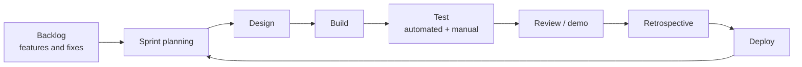
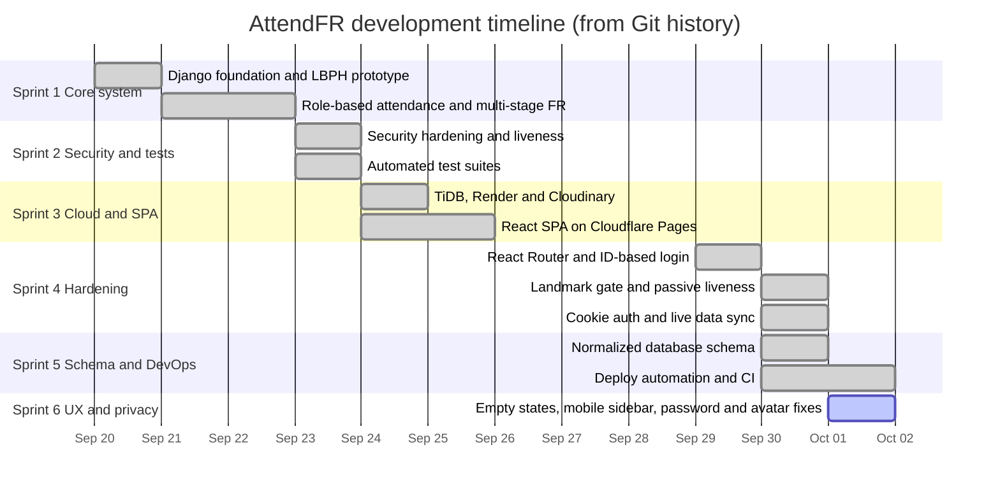
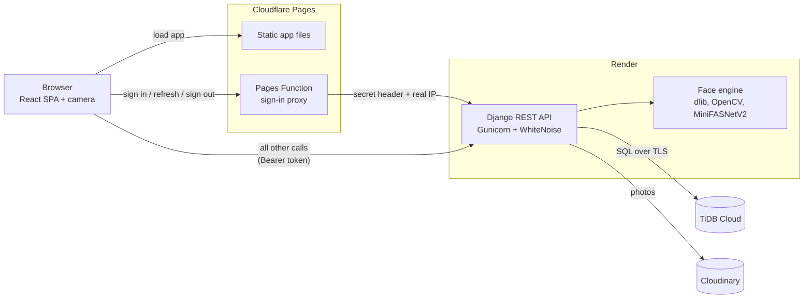
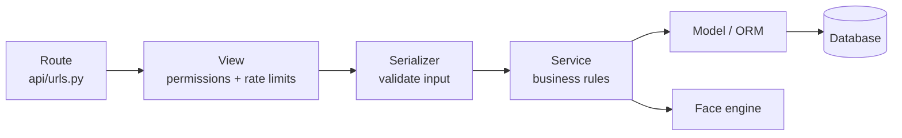
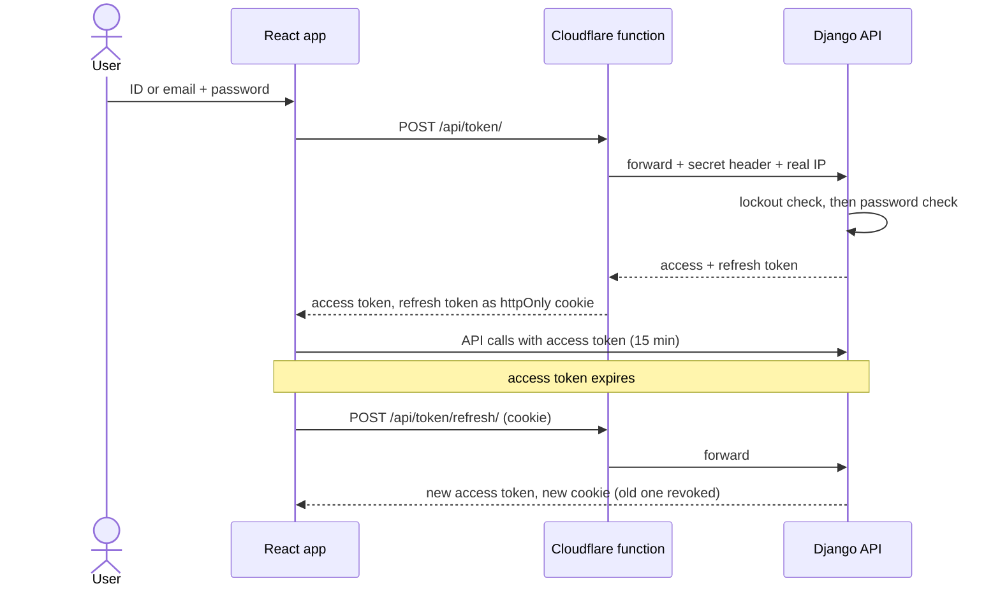
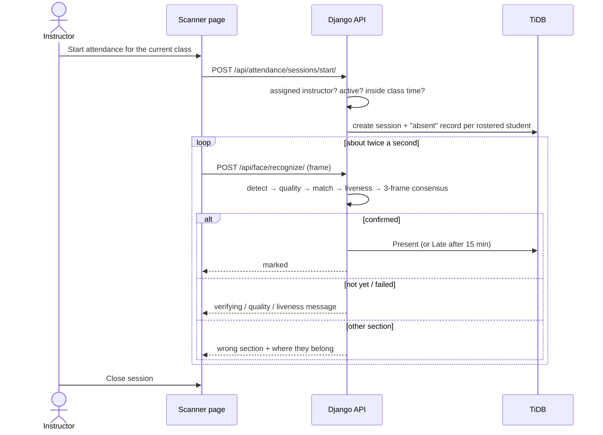
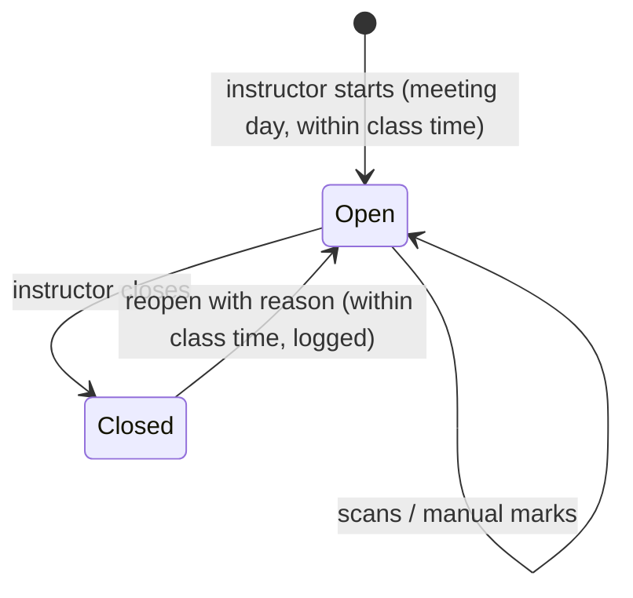
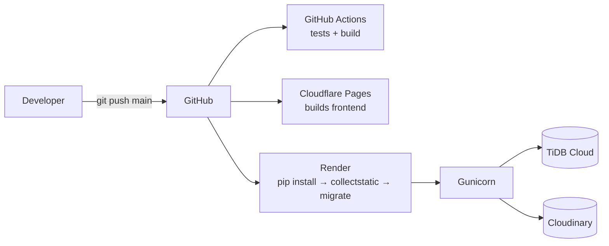

# AttendFR — Project Documentation

AttendFR is a web-based class attendance system. The instructor starts attendance for the class
that is in session and points a webcam or phone camera at the students. Each recognized student
is marked **Present** or **Late**. Photos and phone screens are rejected, so a student cannot be
marked present by someone else.

This document explains how the project was built, what changed over time, how each part works,
and where things stand now. Numbers, table names and file paths come straight from the code.

| | |
|---|---|
| Current version | 3.0 (clean database schema), plus unreleased Sprint 6 work |
| Frontend | React 19 SPA on Cloudflare Pages |
| Backend | Django 6 REST API on Render |
| Database | TiDB Cloud (MySQL-compatible) |
| Photo storage | Cloudinary |
| Tests | 262 backend, 103 frontend, GitHub Actions CI |
| Last updated | October 1, 2026 |

## Contents

1. [Overview](#1-overview)
2. [Development Process (SDLC)](#2-development-process-sdlc)
3. [Changelog](#3-changelog)
4. [Architecture](#4-architecture)
5. [Database](#5-database)
6. [How It Works](#6-how-it-works)
7. [Security](#7-security)
8. [API Reference](#8-api-reference)
9. [Frontend](#9-frontend)
10. [Deployment](#10-deployment)
11. [Testing](#11-testing)
12. [Current Status and Roadmap](#12-current-status-and-roadmap)
13. [Reference: Settings and Commands](#13-reference-settings-and-commands)

---

## 1. Overview

### 1.1 Main features

- **Face attendance.** Recognizes enrolled students one at a time in about 1–3 seconds each.
  A student is marked Present, or Late if more than 15 minutes after the class start.
- **Right class only.** Only the assigned instructor can start a session, only on the class's
  meeting day and within its scheduled time. Only students enrolled in that class are matched.
- **Block and irregular students.** A student can be enrolled in a whole section (block) or in
  just one of its subjects (irregular).
- **Wrong-section detection.** A student who scans in the wrong class is told which section they
  belong to.
- **Anti-spoofing.** Every frame is checked for quality and liveness. A student is marked only
  after three matching frames in a row.
- **One face per student.** A face already enrolled to another student cannot be enrolled again.
- **Corrections with an audit trail.** Instructors can mark students manually and reopen a closed
  session with a reason, which is logged.
- **Reports.** Role dashboards, section reports, session logs and a personal calendar for each
  student.
- **Live updates.** Open screens refresh by themselves when the data changes.

### 1.2 Roles

| Role | Can do | Cannot do |
|---|---|---|
| Administrator | Set up programs, courses, sections, subjects and schedules; manage users; admit students; enroll faces; view all reports | Run attendance sessions |
| Instructor | Start, close and reopen sessions for their own classes; run the scanner; mark students manually; view reports for their sections | Change the academic structure or other instructors' classes |
| Student | View their schedule, attendance per subject and calendar; edit their profile | See other students' data |

Everyone signs in with their Student ID, Faculty ID, username or email.

**Explanation:** The duties are split on purpose. The person who sets up the data (admin) is not
the person who takes attendance (instructor). The server checks every role rule, not just the
menu, so typing the URL of a hidden page gets the user nowhere.

### 1.3 Terms used in this document

| Term | Meaning |
|---|---|
| Face encoding | 128 numbers that describe a face, produced by dlib. Two photos of the same person give close numbers. |
| Distance / tolerance | How different two encodings are. The tolerance is the largest distance still accepted as the same person. |
| Liveness | Checking that the camera sees a real person, not a photo or screen. |
| Consensus | The 3 matching frames in a row needed before a student is marked. |
| Section template | A reusable section of a course, e.g. *BSIT-4A, 4th year* (the "Section Catalog"). |
| Class section | A section template offered in a term (school year + semester). |
| Block / irregular | Enrolled in the whole section / in only one subject of it. |
| Session | One class meeting's attendance. There is one per schedule per day. |

---

## 2. Development Process (SDLC)

### 2.1 Approach: Agile Scrum

The project uses **Agile Scrum**: short sprints, each ending with a working version. Every sprint
goes through planning, design, building, testing, review and deployment.



**Explanation:** Each pass through the loop is one sprint. A few items are picked from the
backlog, built and tested, then shown in a review. The retrospective is where the team agrees
on what to do better, and the working version is deployed before the next sprint starts.

**Why Scrum and not Waterfall:** face recognition can only be tuned with real cameras, real
lighting and real people. Short sprints let the thresholds and the camera UX be adjusted many
times. A single long Waterfall phase would only find these problems at the end.

### 2.2 Timeline

Dates come from the Git history (48 commits so far).



**Explanation:** Each bar is a block of work on the dates it was committed. The sprints are
short (1–3 days) because each one had a single clear goal. There were no commits from
September 26 to 28.

### 2.3 Sprints

| Sprint | Dates | Goal | Result |
|---|---|---|---|
| 1 | Sep 20–22 | Working prototype | Django app with templates, LBPH face recognition, role-based attendance, wrong-section prevention |
| 2 | Sep 23 | Secure and testable | Security hardening (IDOR fixes, DRF permissions, cookie hardening, anti-spoofing), first automated test suites |
| 3 | Sep 24–25 | Online | TiDB Cloud, Render, Cloudinary, React SPA on Cloudflare Pages, CRUD for every module, student admission |
| 4 | Sep 29–30 | Accuracy, security, UX | dlib recognition hardened, ID-based login, landmark quality gate and passive liveness, httpOnly cookie sign-in, live sync |
| 5 | Sep 30–Oct 1 | Clean data and reliable deploys | Normalized schema, deploy tasks inside `migrate`, CI, TiDB and static-file fixes |
| 6 | Oct 1 (in progress) | Consistency and privacy | One Add button for empty tables, mobile sidebar fix, no default passwords, local avatars, this documentation |

**Explanation:** Each sprint builds on the last: first make it work, then make it safe, then put
it online, then make it accurate, then make the data and deploys clean. Sprint 6 is in progress
and not yet committed.

### 2.4 Backlog

| Item | Priority | Status |
|---|---|---|
| Sign in with Student ID / Faculty ID / username / email | High | Done |
| Manage the academic structure, with room and instructor conflict checks | High | Done |
| Guided face enrollment, one face per student | High | Done |
| Block and irregular enrollment | High | Done |
| Attendance only for the assigned instructor during class time | High | Done |
| Automatic Present / Late by face, with photos and screens rejected | High | Done |
| Manual marking and audited reopen | Medium | Done |
| Wrong-section detection | Medium | Done |
| Reports, dashboards and student calendar | High | Done |
| Live updates of open screens | Low | Done |
| Server-side student search for large rosters (instead of long dropdowns) | Medium | Planned |
| Student self-registration with adviser approval | Medium | Planned |
| Consent step and retention policy for face data | Medium | Planned |
| Export reports to CSV / PDF | Low | Planned |

**Explanation:** The backlog is the to-do list of the whole project, ordered by priority. Items
are only marked "Done" when they are deployed and covered by tests. "Planned" items are covered
again in section 12.

---

## 3. Changelog

Versions follow the Git tags (`v2.0.0`, `v2.1.0`). Newest first.

### Unreleased (Sprint 6, not yet committed)

- **Feature:** Public registration with admin approval for students and faculty. The registration
  form collects **complete profile information** matching the admin registration form: ID, full name
  (first, middle, last), gender, birth date and place, civil status, religion, citizenship,
  languages spoken, complete address (street, region, province, municipality via cascading dropdowns),
  mobile number, telephone, email, program/course/year (students) or department (faculty), and
  password. Programs and courses are loaded dynamically from the database (same as admin sees).
  The admin assigns sections and subjects after approval. Accounts awaiting approval show
  `is_active=False` plus an `account_registrations` row (status: pending / approved / rejected),
  and are excluded from the users list. Signing in on a pending or rejected account returns 403
  with `registration_pending` or `registration_rejected`. Registering after rejection replaces
  the previous attempt. New table: `account_registrations` (migration
  `accounts.0003_account_registrations`).
- **Feature:** Required student face enrollment for all students who lack a face photo.
  Self-registered and admin-created students alike must enroll a face before they can use any
  part of the app. The gate is enforced in `RevocationAwareJWTAuthentication.authenticate` and
  returns 403 `face_enrollment_required`; the frontend shows `FaceEnrollmentGateView`. Paths
  allowed without a face: `/api/auth/`, `/api/token/`, `/api/sync/versions/`,
  `/api/face/enroll/check/`, `/api/face/enroll/self/`, `/api/health/`. The enrollment is checked
  once (cached 120s), and no admin review is needed. Turned off in tests unless
  `override_settings(FACE_ENROLLMENT_GATE=True)` is given.
- **Security:** Cloudflare Turnstile CAPTCHA on the registration form, only when
  `TURNSTILE_SECRET_KEY` is set (off in local dev). It fails closed and checks action `register`.
  The frontend receives the site key from `/api/register/options/` so only the secret lives in
  Render; Turnstile is loaded at `https://challenges.cloudflare.com/turnstile/v0/api.js` and
  this domain is added to the CSP (`script-src`, `frame-src`).
- **Security:** Registration rate limit of 30 tries per hour per IP. Throttle scope: `register`.
- **UI:** Empty tables show one centered message with a single Add button. Once there are records,
  the Add button moves to the page header. This is the same on every admin table.
- **UI:** The sidebar menu, account card and Sign Out scroll together, so Sign Out can always be
  reached on phones (all roles).
- **UI:** New admin page "Registrations" (sidebar icon: UserPlus) lists pending and rejected
  accounts with one-click approve/reject controls. Includes student IDs, programs, courses,
  faculty IDs and submitted timestamps. Uses the live-sync group `people`.
- **Security:** The quick register form no longer falls back to `student123`. A strong password
  is required, and the API rejects accounts without one.
- **Privacy:** Avatars without a photo are drawn locally as initials. Names are no longer sent to
  `ui-avatars.com`, and that site is removed from the security policy.
- **Security:** `/admin/login/` now has the same lockout and rate limit as the app's sign-in
  and shares its counters. Before, it accepted unlimited password guesses.
- **Security:** The face-api library and its model are self-hosted under
  `frontend/public/vendor/face-api/1.7.14/`. The security policy now allows scripts only from
  our own site (jsDelivr removed), and the library loads only when a camera page needs it.
- **Security:** Every Python dependency, including sub-dependencies, is pinned to an exact
  version in `requirements.txt`, so builds cannot pick up a new or compromised release.
- **Feature:** Change password on the Profile page (every role). It needs the current password,
  shows the strength checklist and a live "Passwords match / do not match" indicator, and uses
  the same strict rules as the server. Afterwards every device is signed out
  (`POST /api/auth/password/`, 5 tries/min per user).
- **Feature:** Optional two-step sign-in for every role, with an authenticator app (Google /
  Microsoft Authenticator). Turned on in Profile → Security by scanning a QR code; after the
  password, sign-in asks for the 6-digit code. 10 one-time backup codes cover a lost phone,
  and `manage.py disable_2fa <id>` is the last resort. It also applies to `/admin/login/`.
  The secret is encrypted at rest, each code works once, and wrong codes count toward the
  login lockout. New tables: `user_two_factor`, `user_backup_codes`
  (migration `accounts.0002_two_factor`). New pinned packages: `pyotp`, `segno`.
- **UI:** Profile pages are grouped into tabs. Staff: Personal & contact, Professional,
  Institutional (instructors only), Security. Students: Personal, Contact & address, Academic,
  Security.
- **Docs:** New `README.md` (what the system is) and this document.
- **Tests:** 290 backend tests pass (was 262), 111 frontend tests (was 103). New: registration
  with Turnstile (21 tests), 2FA (18), password change (8), admin 2FA login (7), face enrollment
  gate, registration frontend (8), 2FA frontend, password change frontend, sidebar, avatars,
  quick register no-password rule.

### 3.0 — Clean schema (Sep 30 – Oct 1)

- **Database:** The schema was rebuilt and normalized. Sign-in credentials (`users`) are separate
  from personal details (`user_profiles`), Teacher was renamed Instructor, and every app starts
  again from a fresh `0001_initial` migration.
- **Deploys:** `migrate` now resets a database still on the old schema once, creates the cache
  table, and creates the `admin` account if it is missing. All of this runs on every deploy and
  changes nothing when there is nothing to do.
- **Tools:** Added `migrate_fresh --seed` (like Laravel's `migrate:fresh --seed`).
- **CI:** GitHub Actions runs the backend tests, frontend tests and build on every push.
- **Fix:** TiDB does not allow `ADD COLUMN … UNIQUE`, so `students.user_id` is now created with
  the table. A half-finished first migration is recovered automatically.
- **Fix:** Admin pages were unstyled in production. The app order is fixed so `collectstatic`
  copies the CSS.
- **Fix:** Schedule tests failed late at night; the test helper now keeps class times within the
  same day.

### 2.1.0 — Hardening (Sep 29–30)

- dlib-based recognition hardened. The head-turn challenge was replaced with a 68-point landmark
  quality gate plus passive liveness (MiniFASNetV2).
- Faculty ID / Student ID became the login username.
- Instructors only see their own subjects, even inside a shared section.
- Sign-in moved to an httpOnly refresh cookie through a Cloudflare Pages Function; the access token
  is kept in memory only.
- Live data sync added; the face capture UX was redesigned (hands-free, guided).
- Switched to React Router (real URLs instead of `#/` routes).

### 2.0.0 — Cloud and SPA (Sep 24–25)

- Moved to TiDB Cloud, Render and Cloudinary.
- New React SPA on Cloudflare Pages replaced the Django templates. The backend became a REST API.
- Full CRUD for programs, subjects, sections and schedules; student admission wizard.

### 1.x — Prototype (Sep 20–23)

- First Django version with server-rendered templates and LBPH face recognition.
- Role-based attendance, multi-stage recognition, wrong-section prevention.
- Security hardening and the first automated tests.

**Explanation:** The changelog records *what* changed and *why*, release by release. Anyone
reading it can tell why the system looks the way it does today. For example, it explains why
there is only one `0001` migration: the schema was rebuilt in 3.0.

---

## 4. Architecture

### 4.1 Big picture



| Part | Job |
|---|---|
| React SPA | All screens, camera capture, framing hints ("Move closer") |
| Pages Function (`frontend/functions/`) | Handles only sign-in, refresh and sign-out; keeps the long-lived token in an httpOnly cookie |
| Django API | Login, permissions, business rules, face enrollment and recognition |
| TiDB Cloud | All data: users, academic structure, attendance |
| Cloudinary | Profile photos (public) and face photos (private, served through signed links) |

**Explanation:** The browser loads the app from Cloudflare once. Sign-in traffic goes through a
small Cloudflare function so the long-lived token never reaches JavaScript. Everything else goes
straight to the API on Render. Only the API touches the database and photos, and it runs the
face engine itself. The browser only helps with framing and never decides who a face belongs
to.

### 4.2 Backend layers



**Explanation:** Every request takes the same path. The view checks *who* is calling, the
serializer checks *what* they sent, and the service applies the rules, for example "only during
class time". Keeping the rules in services means the same rule is used everywhere. The rule for
who is on a class roster, for example, is shared by recognition, manual marking and reports.

### 4.3 Folder structure

```text
Attendance-Face-Recognition/
├── attendance_fr/          Django project: settings, URLs, auth, permissions, photo storage
│   ├── api/views/          one file per area (auth, classes, attendance, face, reports…)
│   ├── api/serializers/    input validation and JSON output
│   ├── api/services/       business rules (users, attendance, face enrollment, cache, lockout)
│   └── tests/              backend tests (+ factories.py for test data)
├── accounts/               users, profiles, addresses, languages, revoked tokens
│   ├── deploy.py           tasks run with every `migrate`
│   └── management/commands migrate, migrate_fresh, reset_legacy_schema, unlock_login, …
├── core/                   academic structure, enrollments, attendance (models + services)
├── face_app/               face engine: detection, encoding, quality gate, liveness, matching
│   ├── data/               OpenCV Haar cascades (fallback detector)
│   └── models/             MiniFASNetV2 anti-spoofing model (ONNX)
├── frontend/
│   ├── src/views/          one component per page
│   ├── src/components/     feature parts (scanner, faceCapture, sections, users…)
│   ├── src/ui/             shared loaders, dialogs, badges, empty-table row
│   ├── src/test/           frontend tests
│   ├── functions/          Cloudflare sign-in proxy
│   └── public/             _headers (security policy), _redirects (SPA routing)
├── .github/workflows/      CI
├── build.sh, render.yaml   Render build
├── seed.py                 admin + demo data
└── isrgrootx1.pem          public root certificate for TLS to TiDB
```

**Explanation:** The backend has one Django app per job: `accounts` (people), `core` (school
structure and attendance) and `face_app` (faces). `attendance_fr` ties them together and holds
the API. Generated folders such as `.venv/`, `node_modules/`, `dist/` and `staticfiles/` are not
in Git.

---

## 5. Database

### 5.1 ERD


**Explanation:** Each box is a table and each line a relationship. `||` means exactly one, `o|`
zero or one, `o{` zero or many, and `|{` one or many. The key columns are shown only for the
most important tables; section 5.2 lists all of them. In `academic_enrollments`, an empty
`subject_id` means a block student and a filled one means an irregular student.

### 5.2 Tables

| Group | Table | Holds | Key rules |
|---|---|---|---|
| People | `users` | Sign-in only: username, password hash, email, role, active flag | username unique |
| | `user_profiles` | Names, birth data, contact numbers, photo (1:1 with users) | |
| | `user_addresses`, `user_languages` | Addresses (current / permanent) and languages as rows | one address per kind; one row per language |
| | `instructors` | Faculty ID, department, position, office… | faculty_id unique |
| | `students` | Student ID, course, year level | student_id unique |
| | `student_biometrics` | The one face encoding and private face photo per student | one per student |
| | `user_two_factor`, `user_backup_codes` | Optional authenticator-app secret (encrypted) and one-time backup codes (hashed) | one per user / 10 codes per user |
| | `account_registrations` | Self-registration attempts (status: pending / approved / rejected), reviewed_by, rejection_reason, face_consent_at | one active row per user |
| | `revoked_tokens` | Signed-out / already-used login tokens | jti unique |
| Academic | `academic_programs` | College / program (e.g. CITEC) | code unique |
| | `academic_courses` | Degree course under a program (e.g. BSIT) | code unique per program |
| | `academic_terms` | School year + semester | unique pair |
| | `academic_section_templates` | Section Catalog entry (e.g. BSIT-4A) | name unique per course |
| | `academic_class_sections` | A template offered in a term | one per template per term |
| | `academic_subjects` | Subject in a section, with its instructor | course must match the section |
| | `academic_class_schedules` | Start/end time, room, effective dates | no room or instructor overlap |
| | `academic_class_schedule_days` | One row per meeting day | one row per day per schedule |
| | `academic_enrollments` | Student in a section (block) or one subject (irregular) | no duplicates |
| Attendance | `attendance_sessions` | One class meeting's attendance | **one per schedule per date** |
| | `attendance_records` | One student's status in a session, time and confidence | **one per student per session** |
| | `attendance_session_reopen_logs` | Who reopened a session, when and why | append-only |

Django also creates its own tables (`auth_*`, `django_*`) plus `attendfr_security_cache` for
login-lockout counters.

**Explanation:** The schema is normalized (3NF): each fact is stored in one place only. A class
section does not copy its name or course; it reads them from its template. Names live only in
`user_profiles`. Face data sits in its own table, so normal student queries never load it. The
bold rules are enforced by the database itself, so duplicate sessions or duplicate attendance
records are impossible even if the code has a bug.

---

## 6. How It Works

### 6.1 Sign-in



**Explanation:** The password is checked only on the server, after the lockout check. The
refresh token lives in a cookie that page scripts cannot read, and each refresh token works only
once. The short access token is kept in memory and renewed silently, so users stay signed in
without the token sitting in browser storage.

### 6.2 Face enrollment

1. The admin picks a student and starts the camera.
2. The app guides the student ("Center your face", "Move closer", "Hold still") using on-device
   face detection.
3. Each candidate frame is sent to `/api/face/enroll/check/`, which runs the full server checks
   but saves nothing.
4. After 3 accepted frames, the app sends them to `/api/face/enroll/`.
5. The server checks each frame again, encodes it, and combines the frames into one identity.

| Check (each frame) | Rule |
|---|---|
| Image | JPEG / PNG / WEBP, ≤ 2 MB, ≤ 4096 px |
| Detection | dlib HOG only (strict); the face must be inside the on-screen oval with no similar-size second face |
| Quality (68 landmarks) | eye distance ≥ 45 px, brightness 50–215, sharpness ≥ 40, yaw ≤ 15°, pitch ≤ 20°, roll ≤ 10°, eyes open (EAR ≥ 0.20) |
| Liveness | texture, glare and colour checks + MiniFASNetV2 live score ≥ 0.70 |

| Check (combined) | Rule |
|---|---|
| Enough good frames | at least 2 of the 3–5 sent |
| Same person | every pair of frames within 0.5 |
| Not a repeated still image | frames must not be identical |
| Not someone else's face | no other enrolled student within 0.5 → otherwise `409 duplicate_face` |
| Re-enrolling | a different-looking face needs confirmation → otherwise `409 face_mismatch` |

The saved identity is the **average** of the good frames (128 numbers). The face crop is stored
in private storage.

**Explanation:** Checking one frame at a time gives the student instant feedback instead of a
failed capture at the end. Enrollment is stricter than scanning because this face is what every
future scan is compared against. A bad enrollment would cause wrong matches for the whole
semester.

### 6.3 Taking attendance



| Step | Rule |
|---|---|
| Detect | dlib HOG on a 0.42× downscaled frame (fast), with brightness-fix fallbacks |
| Pick face | prefer a face that matches a student not yet marked; otherwise the largest / most central |
| Quality | eye distance ≥ 28 px, brightness 40–230, sharpness ≥ 25, yaw ≤ 20°, pitch ≤ 25°, roll ≤ 15°, eyes open (EAR ≥ 0.17) |
| Match | distance ≤ tolerance (code default 0.38), confidence ≥ 0.62, at least 0.08 better than the 2nd-best student |
| Liveness | same checks as enrollment; fails closed (if it cannot run, the face is rejected) |
| Consensus | 3 matching frames in a row; identical frames do not count |
| Present / Late | Late if more than `LATE_THRESHOLD_MINUTES` (15) after the start time |
| Wrong section | no roster match, but a live match with another enrolled student → show their section |

**Explanation:** The order is what makes it safe. Bad frames are skipped before matching, fakes
are caught before marking, and three frames in a row are needed, so a quick flash of a photo is
not enough. The "better than the 2nd-best" rule stops two look-alike students from being
confused. The class roster is kept in memory as a matrix for 60 seconds, which makes matching
take well under a millisecond.

### 6.4 Session states and corrections



- **Manual mark:** present, late, absent or excused, while the session is open and only for
  students on the roster.
- **Reopen:** only a closed session, only during class time, with a reason of 3–300 characters.
  Every reopen is saved in `attendance_session_reopen_logs`.

**Explanation:** Attendance can only change while a session is open. Any later correction has
to go through a reopen that records who did it and why, so the history cannot be quietly
rewritten.

### 6.5 Other rules

- **Roster:** a schedule's roster is every block student of the section plus the irregular
  students enrolled in that schedule's subject. Recognition, manual marking and reports all use
  this one rule.
- **Schedule conflicts:** a schedule is rejected if the same room, or the same instructor,
  already has a class on a shared day at an overlapping time.
- **Live sync:** saving data bumps a version number for its data group (people, academic,
  attendance, reports, dashboard). Each open browser tab asks for the versions every 3 seconds
  (paused in background tabs) and silently reloads only what changed.
- **Caching:** API responses are cached for 15–120 seconds depending on the group, and face
  rosters for 60 seconds. Every change clears the related cache right away.
- **Deploy tasks:** `migrate` also resets a database on the old schema (once), creates the
  lockout cache table, and creates the `admin` account if missing.

**Explanation:** These rules keep the data consistent. The same roster everywhere means reports
always match what the scanner did. Live sync means two people looking at the same page see the
same data without pressing refresh.

---

## 7. Security

| Risk | Protection |
|---|---|
| Stolen login token | Access token lasts 15 minutes and is kept in memory only. The refresh token sits in an httpOnly, Secure, SameSite=Strict cookie, works once, and is revoked on use and on sign-out. |
| Calls that skip the sign-in proxy | The proxy adds a shared secret (`AUTH_PROXY_SECRET`) that the API checks |
| Password guessing | 5 wrong tries per username + IP locks that pair for 15 minutes; 100 per account in 24 h locks the account; at most 10 logins/min per IP. Applies to both the app sign-in and `/admin/login/`, with shared counters. |
| Weak passwords | At least 8 characters with upper case, lower case, a digit and a symbol; common passwords and passwords similar to the name are rejected; no default passwords |
| Stolen password | Optional two-step sign-in (authenticator app) for every role, on the app and `/admin/`. Secret encrypted at rest (`TWO_FACTOR_KEY`), codes single-use, wrong codes count toward the lockout, backup codes stored as hashes |
| Seeing other people's data | Every endpoint checks the role. Instructors only reach their own subjects and sessions; students only their own records. |
| Face photo leaks | Private storage; the API gives out signed links that expire after 5 minutes and stop working when the photo is replaced |
| Spoofing | Quality gate, liveness (fails closed), 3-frame consensus, replay check, duplicate-face block |
| Bad uploads | Only real JPEG/PNG/WEBP images, size and dimension limits |
| Injected scripts / clickjacking | Content-Security-Policy allows scripts only from our own site (face-api is self-hosted); `X-Frame-Options: DENY`, `nosniff`; the camera is allowed only on the app's own site |
| Tampered dependencies | Every Python package is pinned to an exact version; the frontend uses `package-lock.json` with `npm ci` |
| Eavesdropping | HTTPS with HSTS; TLS to TiDB |
| Abuse of heavy endpoints | Rate limits: recognize 180/min, enroll 30/min, enroll check 240/min, face photos 600/min, sync 120/min |

**Explanation:** Each risk is covered by more than one layer, so one mistake does not expose
anything. Face data gets the most protection because it cannot be changed like a password if it
leaks.

---

## 8. API Reference

All routes are under `/api/`, return JSON, and need a Bearer token unless noted.

| Area | Routes | Who |
|---|---|---|
| Health | `GET /api/health/` | Public |
| Registration | `GET /api/register/options/` (Turnstile site key + programs/courses); `POST /api/register/` (Turnstile + throttled) | Public |
| | `GET /api/registrations/`, `POST /api/registrations/{user_id}/approve/`, `POST …/reject/` (reason) | Admin |
| Sign-in | `POST /api/token/`, `POST /api/token/refresh/`, `POST /api/auth/logout/` | Public (through the proxy in production) |
| Own account | `GET`/`PATCH /api/auth/me/`, `POST /api/auth/password/` | Signed-in user |
| Two-step sign-in | `POST /api/token/2fa/` (second sign-in step); `GET /api/auth/2fa/`, `POST /api/auth/2fa/setup/`, `…/enable/`, `…/disable/`, `…/backup-codes/` | Second step: holder of a valid sign-in challenge; the rest: signed-in user |
| Live sync | `GET /api/sync/versions/` | Signed-in user |
| Dashboard | `GET /api/dashboard/stats/` | All roles (different data per role) |
| Academic | `/api/programs/`, `/api/courses/`, `/api/program-sections/`, `/api/sections/`, `/api/subjects/`, `/api/schedules/` (+ `/{id}/`) | Read: all; write: admin |
| Enrollments | `/api/sections/{id}/enrollments/`, `…/enrollments/{eid}/` | Read: users with access to the section; write: admin |
| Users | `/api/users/`, `/api/users/{id}/`, `/api/students/`, `/api/students/next-id/` | Admin |
| Sessions | `GET /api/attendance/sessions/`, `POST …/start/`, `POST …/{id}/close/`, `POST …/{id}/reopen/`, `GET …/{id}/` | Instructor (own classes); list filtered by role |
| Manual mark | `POST /api/attendance/records/mark/` | The session's instructor |
| Student | `GET /api/attendance/student/overview/`, `GET /api/attendance/student/calendar/{section_id}/` | Student (own data) |
| Face | `POST /api/face/enroll/check/`, `POST /api/face/enroll/` | Admin |
| | `POST /api/face/enroll/self/` | Student without a face (self-registered or admin-created) |
| | `POST /api/face/recognize/` | The session's instructor |
| | `GET /api/media/face/{student_id}/?token=…` | Anyone holding a valid signed link |

Status codes: `400` bad input · `401` not signed in · `403` not allowed or outside class time ·
`404` not found or not yours · `409` conflict (duplicate face, closed session) ·
`429` too many requests or locked account · `503` face engine unavailable.

**Explanation:** Reading data is open to more roles than changing it. The status codes let the
app show the right message. For example, a 409 on enrollment becomes "This face is already
enrolled to …".

---

## 9. Frontend

| Role | Pages |
|---|---|
| Admin | Dashboard, Programs, Courses, Section Catalog, Class Sections, Subjects, Schedules, Users, Registrations (approve/reject), Face Enrollment, Student Admission, Section Report, Session Logs, Profile |
| Instructor | Dashboard, Sections & Schedules, Attendance Reports, Live Scanner, Profile |
| Student | Dashboard, My Schedule, My Records, Profile |
| Public (not signed in) | Sign In, Register (student or faculty) |

**UI rules used on every page**

- The same layout everywhere: a sidebar (scrollable on phones, with the account card and Sign
  Out inside the scroll) and a header holding the page's main action.
- An empty table shows one centered message and **one** Add button. When records exist, the Add
  button is in the header instead. When filters hide every row, a "Clear filters" button is shown.
- Delete always asks for confirmation; deactivate is offered where history must be kept.
- Avatars show the photo, or initials drawn in the app.
- Face capture is hands-free with live guidance and automatic retries.

**Explanation:** Pages are protected twice: the app hides pages a role cannot open, and the API
refuses the data anyway. Keeping the same rules on every page means users learn the layout once.

---

## 10. Deployment



| Service | Runs | Needs |
|---|---|---|
| Cloudflare Pages | Frontend + sign-in proxy | `BACKEND_ORIGIN`, `PROXY_SECRET`, `VITE_*` |
| Render | Django API (health check `/api/health/`) | `SECRET_KEY`, `DEBUG=False`, `ALLOWED_HOSTS`, `CORS_ALLOWED_ORIGINS`, `CSRF_TRUSTED_ORIGINS`, `DB_*`, `CLOUDINARY_*`, `AUTH_PROXY_SECRET`, `TRUSTED_PROXY_COUNT=1`, `SEED_ADMIN_PASSWORD` |
| TiDB Cloud | Database | Port 4000, TLS on (`DB_USE_SSL=True`) |
| Cloudinary | Photos | API keys |

**First deploy**

1. Fill in the variables above. `AUTH_PROXY_SECRET` on Render and `PROXY_SECRET` on Cloudflare
   must have the same value.
2. **Generate and set `TWO_FACTOR_KEY`** (see below) — do this before anyone enables 2FA!
3. Set `TURNSTILE_SITE_KEY` and `TURNSTILE_SECRET_KEY` (see Turnstile setup guide).
4. Set `SEED_ADMIN_PASSWORD`, then deploy.
5. Check that `/api/health/` returns `{"status": "healthy", "database": "connected"}`.
6. Sign in as `admin` and change the password.

**Setting up TWO_FACTOR_KEY (Important!)**

The `TWO_FACTOR_KEY` encrypts 2FA secrets in the database. Set it once and **never change it**, or
everyone who enabled 2FA will lose access.

1. Generate a secure random 50-character key:
   ```powershell
   # PowerShell
   -join ((48..57) + (65..90) + (97..122) | Get-Random -Count 50 | ForEach-Object {[char]$_})
   ```
   Or use https://1password.com/password-generator/ (50 characters, letters + numbers)

2. On Render → Environment → Add Environment Variable:
   - Key: `TWO_FACTOR_KEY`
   - Value: (your 50-character random key)
   
3. Save and redeploy.

4. **Store this key safely** (password manager) in case you need to restore a backup.

If you skip this step, it falls back to `SECRET_KEY`, which means rotating `SECRET_KEY` later will
break everyone's 2FA.

**Explanation:** A push to `main` runs the tests on GitHub and rebuilds the frontend on
Cloudflare. Render rebuilds the API too if its Auto-Deploy is on; it is currently off, so use
**Manual Deploy → Deploy latest commit**. The database setup happens inside `migrate` during the
build, so no shell access to the server is needed.

---

## 11. Testing

| Type | Tool | Covers |
|---|---|---|
| Backend unit + API | Django test runner (in-memory SQLite, never TiDB or Cloudinary) | Face engine, rules, every endpoint's permissions and responses |
| Security | Django test runner | Lockout, token rotation and revocation, proxy secret, access control, signed photo links |
| Frontend components | Vitest + Testing Library | Routing guards, forms, scanner, modals, empty states, sidebar, avatars |
| Lint / build | oxlint, Vite | Code mistakes, production build |
| Manual | Real cameras and users | Lighting, phones, spoof attempts |

| Backend file | Tests | Focus |
|---|---|---|
| `test_security.py` | 46 | Login security, tokens, passwords |
| `test_face_recognition.py` | 30 | Recognition, consensus, duplicates, wrong section |
| `face_app/tests.py` | 29 | Face engine helpers |
| `test_registration.py` | 21 | Public registration with Turnstile, admin approval/reject, face enrollment gate |
| `tests_api.py` | 20 | API contract |
| `test_authorization.py` | 19 | Who can access what |
| `test_two_factor.py` | 18 | Two-step sign-in: setup, codes, backup codes, lockout, admin login, turn off |
| `test_face_photos.py` | 15 | Private photos and signed links |
| `core/tests.py` | 13 | Models, schedules, conflicts |
| `test_classes.py` | 11 | Sections, subjects, enrollments |
| `accounts/tests.py` | 10 | Users and login |
| `test_schema.py` | 9 | Normalized tables, no default password |
| `test_response_cache.py` | 8 | Caching and live sync |
| `test_password_change.py` | 8 | Change password: rules, wrong current password, sign-out everywhere |
| `test_attendance.py` | 7 | Sessions and manual marking |
| `test_admin_login.py` | 7 | Lockout and rate limit on `/admin/login/` |
| `test_courses.py`, `test_auth.py`, `test_reports.py` | 12 | Courses, sign-in, reports |

The runner reports **290 backend tests**. Vitest reports **111 frontend tests** in 21 files.

```bash
python manage.py test                    # backend (290 tests)
cd frontend && npm test                  # frontend (111 tests)
cd frontend && npm run lint && npm run build
```

**Latest results:** frontend 111/111 passed, lint 0 errors, and the build succeeds. Backend
290/290 passed. The full backend and frontend suites run in CI on every push.

**Bugs caught by testing**

| Bug | How it was found | Fix |
|---|---|---|
| Schedule tests failed after ~11:15 PM | Full test run | Test class times stay within the same day |
| TiDB refused part of the first migration | Production deploy log | Column created with its table; half-built databases recover automatically |
| Admin pages without CSS in production | Deploy log | App order fixed so static files are collected |
| Quick register used a shared default password | Code review | Password required; test added |

**Explanation:** Security and face recognition have the most tests because mistakes there do
the most damage. Two of the bugs above appeared only in production, which is why every deploy
log is read. Each fix comes with a test or an automatic recovery, so the bug cannot quietly
return.

---

## 12. Current Status and Roadmap

### 12.1 Working now

- Every feature in section 1.1, deployed on Cloudflare Pages, Render and TiDB with a fresh clean
  schema and an `admin` account.
- CI on every push.

### 12.2 Not yet committed (Sprint 6)

The UI consistency changes, mobile sidebar fix, no-default-password fix, local avatars, new
tests, `README.md` and this document are on the development machine only.

### 12.3 Known issues and limits

| Issue | Impact | Plan |
|---|---|---|
| User and student lists return at most 100 records, and searches only look inside those | Students beyond the first 100 do not appear in the section-enroll dropdown or in Face Enrollment search | Server-side search + pagination |
| Render free tier sleeps and has 1 worker | First request after idle can take ~50 s; many scans at once queue up | Paid instance; background worker for matching |
| In-memory cache per worker | Cache and rate limits are not shared if more workers are added | Redis |
| Recognizes one face at a time | Students scan in a queue | Acceptable for now |
| Starting a session again after closing it on the same day | Not possible (one session per meeting) | Use **Reopen** |
| `FACE_RECOGNITION_TOLERANCE` is 0.38 in code but 0.5 in `render.yaml` | The live value depends on the Render dashboard setting | Pick one value after camera testing |
| `render.yaml` is not linked to the live Render service | Changing the file does nothing | Link it as a Blueprint, or delete it |
| Render Auto-Deploy is off | Each deploy is manual | Turn on "After CI Checks Pass" |
| Leftover files (`fix_emojis*.py`, `step238_*`, `frontend/REFACTORING_*.md`, `DashboardView.REFACTORED.jsx`) and an outdated `PROJECT_GUIDE.md` | Clutter | Remove / update |

### 12.4 Roadmap

1. Server-side student search (prefix search on indexed Student ID and names) and pagination.
2. Student self-registration, active only after adviser or instructor approval.
3. Consent step before face enrollment and a retention policy for face data (Data Privacy Act).
4. CSV / PDF report export and low-attendance alerts.
5. Paid hosting, Redis and a background worker before school-wide use.

**Explanation:** This section is the honest picture of the project today: what works, what is
waiting to be committed, and what is known to be weak. The roadmap is ordered by what users will
hit first. For example, the 100-record limit matters as soon as a school has more than 100
students.

---

## 13. Reference: Settings and Commands

### 13.1 Main settings (environment variables)

| Variable | Purpose | Default |
|---|---|---|
| `SECRET_KEY`, `DEBUG`, `ALLOWED_HOSTS` | Django basics | —, `False`, localhost |
| `CORS_ALLOWED_ORIGINS`, `CSRF_TRUSTED_ORIGINS` | Frontend address(es) | localhost dev ports |
| `DB_ENGINE`, `DB_HOST`, `DB_PORT`, `DB_NAME`, `DB_USER`, `DB_PASSWORD`, `DB_USE_SSL` | Database | local MySQL |
| `CLOUDINARY_CLOUD_NAME`, `CLOUDINARY_API_KEY`, `CLOUDINARY_API_SECRET` | Photo storage (local files if blank) | blank |
| `AUTH_PROXY_SECRET` | Shared secret with the Cloudflare proxy | blank |
| `TURNSTILE_SITE_KEY`, `TURNSTILE_SECRET_KEY` | Cloudflare Turnstile CAPTCHA on registration; turned on only when the secret is set | blank (off) |
| `FACE_ENROLLMENT_GATE` | Require face before a student can use the app | `True` (off in tests) |
| `TWO_FACTOR_KEY` | Encryption key for two-step sign-in secrets; set once and never change it | falls back to `SECRET_KEY` |
| `TRUSTED_PROXY_COUNT` | Proxies in front of Django (Render = 1) | `0` |
| `JWT_ACCESS_MINUTES`, `JWT_REFRESH_DAYS` | Token lifetimes | `15`, `7` |
| `LOGIN_MAX_FAILED_ATTEMPTS`, `LOGIN_LOCKOUT_MINUTES` | Lockout per username + IP | `5`, `15` |
| `LOGIN_ACCOUNT_MAX_FAILURES`, `LOGIN_ACCOUNT_WINDOW_HOURS` | Lockout per account | `100`, `24` |
| `THROTTLE_REGISTER` | Public registration rate limit | `30/hour` per IP |
| `THROTTLE_TWO_FACTOR`, `THROTTLE_PASSWORD_CHANGE` | Two-step sign-in and password-change limits | `10/min`, `5/min` per user |
| `FACE_RECOGNITION_TOLERANCE` | Max match distance (lower = stricter) | `0.38` |
| `MIN_FACE_CONFIDENCE`, `FACE_MATCH_MARGIN` | Confidence floor, gap to 2nd best | `0.62`, `0.08` |
| `FACE_CONSENSUS_FRAMES` | Frames in a row before marking | `3` |
| `FACE_ANTISPOOF_THRESHOLD` | Liveness score needed | `0.7` |
| `FACE_DUPLICATE_TOLERANCE` | Duplicate-face distance at enrollment | `0.5` |
| `FACE_ENROLL_*`, `FACE_SCAN_*` | Quality-gate limits (see 6.2 and 6.3) | |
| `LATE_THRESHOLD_MINUTES` | Minutes after start before "Late" | `15` |
| `FACE_PHOTO_LINK_SECONDS` | Signed photo link lifetime | `300` |
| `SEED_ADMIN_PASSWORD`, `SEED_DEMO_PASSWORD` | Seed passwords (random and printed if blank) | blank |

### 13.2 Commands

| Command | Does |
|---|---|
| `python manage.py migrate` | Migrate + deploy tasks (one-time old-schema reset, cache table, admin account) |
| `python manage.py migrate --skip-deploy-tasks` | Plain Django migrate |
| `python manage.py migrate_fresh --seed [--demo] [--force]` | Drop **all** tables, migrate, create admin (and demo class) |
| `python manage.py unlock_login <id>` | Clear a login lockout |
| `python manage.py disable_2fa <id>` | Turn off two-step sign-in for someone who lost their phone and backup codes (check their identity first) |
| `python manage.py make_face_photos_private --apply` | Move face photos to private storage |
| `python seed.py [--admin-only]` | Create admin (and demo class) |
| `python manage.py test_features` / `test_api` | Formatted test runs |
