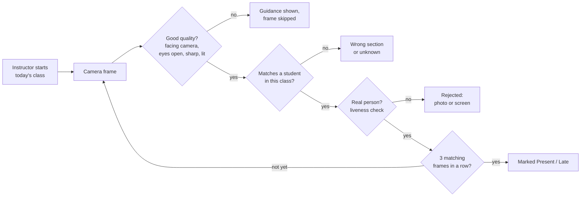
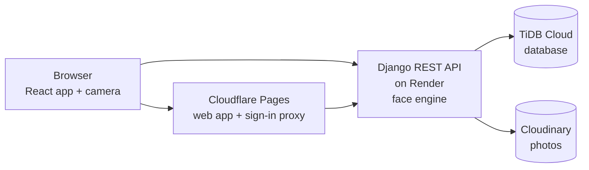

# AttendFR — Face Recognition Attendance System

AttendFR is a web-based class attendance system for colleges. The instructor opens
attendance for the class that is in session, points a webcam or phone camera at the students,
and each student is marked **Present** or **Late** by face — no roll call, no sign-in sheet,
no ID cards.

Photos and phone screens of a classmate's face are rejected, so attendance cannot be faked
for someone who is absent.

---

## What it does

- **Takes attendance by face.** Recognizes enrolled students one at a time in about 1–3
  seconds and marks them Present, or Late after 15 minutes.
- **Only for the right class.** Sessions can be started only by the assigned instructor, on
  the class's meeting day, within its scheduled time. Only students enrolled in that class are
  matched.
- **Knows block and irregular students.** A student can be enrolled in a whole section or
  only in one of its subjects; attendance follows exactly what each student takes.
- **Catches wrong-section scans.** A student who scans in the wrong class is told which
  section they belong to.
- **Stops spoofing.** Every frame is checked for quality and liveness, and a student is marked
  only after several consecutive live matches.
- **One face per student.** A face that is already enrolled to another student cannot be
  enrolled again.
- **Keeps records correctable and auditable.** Instructors can mark students manually and
  reopen a closed session with a written reason that is logged.
- **Reports for everyone.** Dashboards, section attendance reports, session logs, and a
  personal attendance calendar for each student.
- **Stays up to date.** Open screens refresh by themselves when data changes.

## Who uses it

| Role | What they do |
|---|---|
| **Administrator** | Sets up programs, courses, sections, subjects and schedules; manages accounts; admits students and enrolls their faces; views all reports. |
| **Instructor** | Starts attendance for their own classes, runs the live scanner, corrects records, views reports for their sections. |
| **Student** | Views their schedule, attendance per subject and a day-by-day calendar. |

Everyone signs in with their **Student ID**, **Faculty ID**, username or email.

## How attendance works

**Face enrollment** is done once per student with a guided, hands-free camera capture. The
system checks position, lighting, sharpness, head angle and liveness, combines three good
frames into one face identity, and refuses duplicates.

## Architecture

| Part | Technology |
|---|---|
| Web app | React 19, React Router, Vite — hosted on Cloudflare Pages |
| API | Django 6, Django REST Framework, SimpleJWT — hosted on Render |
| Face engine | dlib 128-D face embeddings, OpenCV, NumPy, MiniFASNetV2 anti-spoofing model |
| Database | TiDB Cloud (MySQL-compatible), normalized to 3NF |
| Photo storage | Cloudinary (face photos private, served through expiring signed links) |
| Quality | 290 backend tests, 111 frontend tests, GitHub Actions CI |

## Security and privacy

- **Admin-created accounts only.** There is no public registration: the administrator creates
  every student and instructor account. A wrong password never reveals whether an account exists.
- **Required face enrollment for students.** Every student must enroll a face before they can use any part of the app. The gate is enforced on the server
  (403 `face_enrollment_required`). No admin review of the face is needed; the duplicate-face
  check at enrollment mitigates the risk of trolling (if a student enrolls someone else's face,
  they cannot take attendance for them because the face is already enrolled).
- Short-lived sign-in tokens; the long-lived token is kept in a secure cookie that page
  scripts cannot read.
- Account lockout after repeated wrong passwords, and rate limits on sign-in, registration and
  face endpoints.
- Strong passwords required for every account; there are no default passwords.
- Optional two-step sign-in for everyone: a 6-digit code from an authenticator app on your
  phone, plus one-time backup codes.
- Every action is checked against the user's role, and instructors and students can only see
  their own classes and records.
- Face data is stored separately from personal data. Face photos are private and only shown
  through links that expire after 5 minutes.
- No personal data is sent to third-party avatar or analytics services.

## Project status

The system is deployed and in active development as a capstone project.

**Latest additions (Sprint 6, unreleased)**

- Public registration and Turnstile CAPTCHA removed (admin creates every account)
- Required student face enrollment (no skip, no admin review)
- Optional two-step sign-in (2FA) with authenticator apps for all roles
- Change password on the Profile page
- Tabbed Profile pages (Personal, Security, Academic, etc.)
- Empty-state UI consistency across all tables
- Scrollable sidebar so Sign Out is always reachable

**Planned next**

- Fast server-side student search for large rosters
- Report export (CSV/PDF)
- Attendance analytics and trends

---

Built as a 4th-year capstone project.
